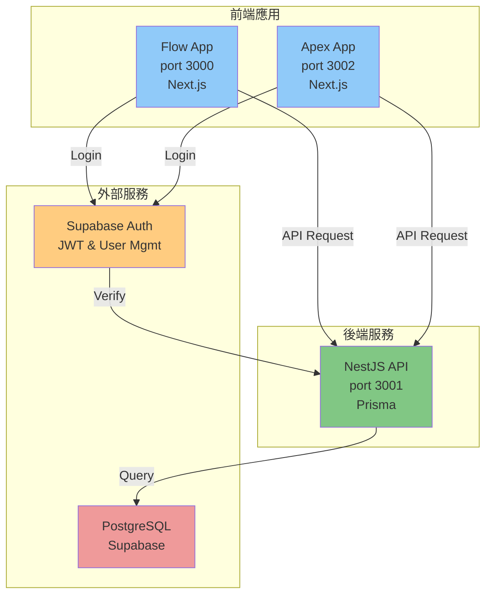
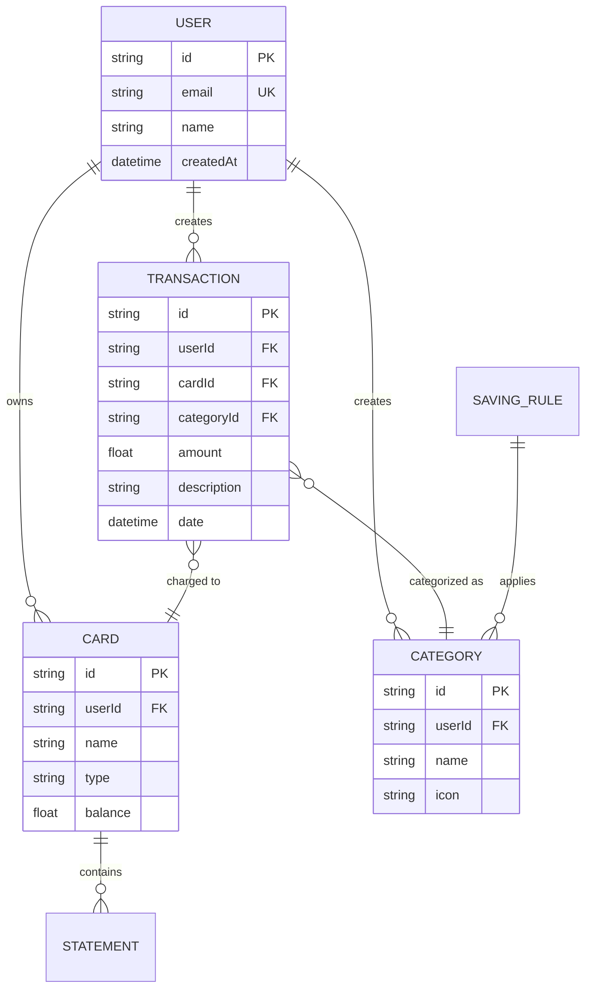

# UML 和文檔規劃

**討論日期**: 2025-11-04
**狀態**: 📋 規劃階段
**必要性**: 📊 低優先級（Sprint 7 之後評估）

---

## 📋 背景

在 Sprint 6 完成後，討論了如何使用 UML 圖表來文檔化系統設計。本文檔整理了可行的方案、工具選擇、和具體的實施規劃。

---

## 🛠️ 工具選擇分析

### 1. **Mermaid** ⭐ 推薦

**優點**:

- ✅ GitHub 原生支援（自動渲染）
- ✅ 純文字編寫（易於版本控制）
- ✅ VS Code 支援 preview（裝 extension）
- ✅ 語法簡單
- ✅ 無需額外服務

**缺點**:

- ❌ 高級功能有限
- ❌ 自定義選項少

**適用場景**: 系統架構、流程圖、序列圖

**VS Code Extension**: `Markdown Preview Mermaid Support`

---

### 2. **PlantUML**

**優點**:

- ✅ 功能豐富（支援 C4、UML 標準）
- ✅ 適合企業級文檔
- ✅ VS Code 有 extension

**缺點**:

- ❌ 需要安裝和配置
- ❌ 學習曲線陡
- ❌ GitHub 不原生支援（需轉換成圖片）

**適用場景**: 複雜的企業架構、詳細的 ER 圖

---

### 3. **Draw.io / Excalidraw**

**優點**:

- ✅ 視覺化編輯
- ✅ 可存放在專案裡（`.drawio` 檔案）
- ✅ Git 可追蹤

**缺點**:

- ❌ 檔案較大
- ❌ 編輯較耗時
- ❌ 需要特殊 viewer

**適用場景**: 複雜的系統設計圖、團隊協作

---

## 💡 推薦方案

**使用 Mermaid**:

- 簡單高效
- GitHub 友善
- 適合現階段需求
- VS Code 支援預覽

---

## 📚 可創建的 UML 文檔

### 優先級排序

#### 🥇 高優先級（Sprint 8-0.9 時創建）

1. **系統架構圖** `docs/architecture/system-architecture.md`
   - Flow App (port 3000)
   - Apex App (port 3002)
   - NestJS API (port 3001)
   - Supabase (Auth + DB)
   - 互連關係

2. **資料庫 ER 圖** `docs/architecture/database-er-diagram.md`
   - User, Transaction, Category, Card 等 7 個表
   - 外鍵關係
   - 索引策略

#### 🥈 中優先級（Sprint 1 時創建）

3. **認證流程序列圖** `docs/guides/authentication-flow.md`
   - Supabase Auth → NestJS API
   - JWT Token 驗證
   - 錯誤處理

4. **記帳交易流程** `docs/guides/transaction-flow.md`
   - 使用者提交
   - API 驗證
   - 資料庫儲存
   - 狀態更新

#### 🥉 低優先級（按需創建）

5. **API 路由文檔** `docs/architecture/api-routes.md`
6. **部署架構** `docs/architecture/deployment-architecture.md`
7. **安全流程** `docs/architecture/security-architecture.md`

---

## 📋 具體實施計劃

### Phase 1: Sprint 7（Apex App）

- ✅ 不創建 UML（專注 Apex 實現）
- 📝 記錄需求（為後續 UML 準備）

### Phase 2: Sprint 8（CI/CD & Testing）

- 📊 創建「系統架構圖」
- 📊 創建「資料庫 ER 圖」
- 📝 更新 `docs/README.md` 導航

### Phase 3: Sprint 9（Security）

- 📊 創建「認證流程序列圖」
- 📊 創建「安全流程圖」

### Phase 4: Sprint 1（Authentication）

- 📊 細化認證流程圖
- 📊 創建「記帳交易流程」

---

## 🎯 範例模板

### Mermaid 系統架構圖



### Mermaid 資料庫 ER 圖



---

## 🔧 VS Code 設定

### 安裝 Mermaid Extension

```bash
# 在 VS Code 中搜尋並安裝
"Markdown Preview Mermaid Support"
```

### 使用

1. 在 markdown 檔案中編寫 mermaid 代碼
2. 按 `Cmd + Shift + V`（Mac）或 `Ctrl + Shift + V`（Windows/Linux）預覽
3. 推到 GitHub 時自動渲染

---

## 📌 決策記錄

| 決策項   | 選擇                 | 理由                          |
| -------- | -------------------- | ----------------------------- |
| UML 工具 | Mermaid              | 簡單、GitHub 友善、易維護     |
| 創建時機 | Sprint 8+            | 不阻塞 Sprint 7，聚焦核心功能 |
| 優先級   | 先系統架構           | 架構理解最重要                |
| 儲放位置 | `docs/architecture/` | 與現有結構一致                |

---

## 📚 相關文檔

- [Sprint 0 Overview](./overview.md)
- [Sprint 0 Tasks](./tasks.md)
- [Architecture Documentation](../architecture/README.md)
- [Development Setup Guide](../guides/development-setup.md)

---

**最後更新**: 2025-11-04
**下一步**: Sprint 7 實施，後續在 Sprint 8 開始創建 UML 文檔
