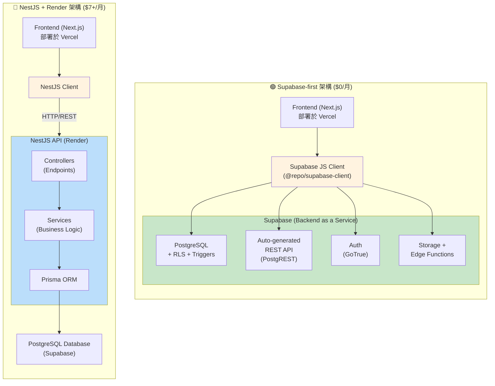

# Supabase vs NestJS 架構比較

**狀態**: ✅ 完整

---

## 🎯 比較目的

本文檔詳細比較 **Supabase-first 架構**與傳統 **NestJS + Render 架構**的差異，幫助理解 Sprint 8 的遷移決策（[ADR 001](../../decisions/001-architecture-simplification.md)）。比較涵蓋成本、開發效率、維護負擔、擴展性、安全性等多個面向。

**目標受眾**：

- 評估專案架構的開發者
- 考慮遷移至 Supabase 的團隊
- 需要理解架構權衡的技術決策者

---

## 📊 整體比較表

| 面向         | Supabase                    | NestJS + Render             | 優勢       |
| ------------ | --------------------------- | --------------------------- | ---------- |
| **成本**     | $0/月（免費層）             | $7+/月                      | Supabase   |
| **開發時間** | 快 60%                      | 基準                        | Supabase   |
| **維護工作** | 少 70%                      | 基準                        | Supabase   |
| **學習曲線** | 平緩（SQL + Supabase docs） | 陡峭（NestJS + Prisma）     | Supabase   |
| **擴展性**   | 自動（Supabase 管理）       | 手動配置                    | Supabase   |
| **靈活性**   | 中等（Edge Functions 補充） | 高（完全自訂）              | NestJS     |
| **控制度**   | 低（Supabase 管理）         | 高（完全控制）              | NestJS     |
| **適合場景** | 標準 CRUD + 簡單業務邏輯    | 複雜業務邏輯 + 多步驟工作流 | 取決於需求 |

---

## 🏗️ 架構對比

### 視覺化對比



**部署與成本對比**：

| 架構     | 部署環境                                         | 月成本  | 管理複雜度 |
| -------- | ------------------------------------------------ | ------- | ---------- |
| Supabase | Vercel (Frontend) + Supabase (Backend)           | **$0**  | 低 ⭐      |
| NestJS   | Vercel (Frontend) + Render (API) + Supabase (DB) | **$7+** | 高 ⭐⭐⭐  |

---

### 架構特性摘要

**詳細的架構比較請參閱**: [ADR 001 - 為何選擇 Supabase](./decisions.md#adr-001-為何選擇-supabase)

**關鍵差異**：

| 特性         | Supabase            | NestJS              |
| ------------ | ------------------- | ------------------- |
| **開發速度** | ✅ 快速（自動 API） | ❌ 較慢（手寫代碼） |
| **成本**     | ✅ $0/月            | ❌ $7+/月           |
| **控制度**   | ⚠️ 中等             | ✅ 完全控制         |
| **學習曲線** | ✅ 平緩             | ❌ 陡峭             |
| **適合場景** | 標準 CRUD           | 複雜業務邏輯        |

---

## 🔄 功能對應表

| 功能           | Supabase 實作            | NestJS 實作                     | 開發時間比較    |
| -------------- | ------------------------ | ------------------------------- | --------------- |
| **資料庫**     | PostgreSQL (內建)        | Prisma + PostgreSQL             | 相同            |
| **API**        | Auto-generated REST      | 手動實作 Controllers + Services | Supabase 快 90% |
| **認證**       | Supabase Auth (GoTrue)   | Passport.js + JWT               | Supabase 快 80% |
| **授權**       | Row Level Security (RLS) | Guards + Decorators             | Supabase 快 60% |
| **檔案上傳**   | Supabase Storage         | Multer + Cloud Storage (S3/GCS) | Supabase 快 70% |
| **Realtime**   | Supabase Realtime (內建) | WebSocket/Socket.io             | Supabase 快 80% |
| **Serverless** | Edge Functions (Deno)    | Cloud Functions (GCP/AWS)       | 相同            |
| **類型生成**   | Supabase CLI (自動)      | Prisma CLI (自動) + 手動 DTOs   | Supabase 快 50% |
| **Migration**  | SQL 檔案 (Supabase CLI)  | Prisma migrations               | 相同            |

---

## 📈 開發體驗比較

### 範例：新增「交易」CRUD 功能

**完整程式碼範例請參閱**: [ADR 001 - 實作比較](./decisions.md#實作範例比較)

**開發時間對比**：

| 步驟                | Supabase          | NestJS                                |
| ------------------- | ----------------- | ------------------------------------- |
| **Database Schema** | 30 分鐘（含 RLS） | 15 分鐘                               |
| **API 實作**        | ✅ 自動生成       | 80 分鐘（DTO + Service + Controller） |
| **權限控制**        | ✅ RLS 內建       | 20 分鐘（Guards）                     |
| **前端整合**        | 15 分鐘           | 20 分鐘                               |
| **測試撰寫**        | 可選              | 60 分鐘                               |
| **部署**            | ✅ 自動           | 15 分鐘                               |
| **總計**            | **45 分鐘**       | **3 小時 5 分鐘**                     |
| **時間節省**        | **基準**          | **-75%**                              |

**關鍵差異**：

- **Supabase**: Schema → 自動 API → 前端使用（3 步驟）
- **NestJS**: Schema → Migration → DTO → Service → Controller → Module → 測試 → 部署（8 步驟）

---

## 💰 成本比較

**詳細成本分析請參閱**: [ADR 001 - 成本考量](./decisions.md#成本考量)

### 方案對比

| 方案     | Supabase                  | NestJS + Render |
| -------- | ------------------------- | --------------- |
| **免費** | $0/月（✅ Flourish 當前） | ❌ 無           |
| **入門** | Pro $25/月                | Starter $7/月   |
| **進階** | Team $599/月              | Standard $25/月 |
| **企業** | Enterprise (客製)         | Pro $85/月      |

**成本節省**: Release 0-1 節省 **$7/月（100%）**

---

## 🎓 學習曲線

### 學習時間對比

| 技術棧       | 必學知識                                           | 學習時間 | 難度            |
| ------------ | -------------------------------------------------- | -------- | --------------- |
| **Supabase** | PostgreSQL + RLS + Client API + Next.js 整合       | 3-4 週   | ⭐⭐⭐ 中等     |
| **NestJS**   | NestJS 核心 + Prisma + Auth + Testing + Deployment | 6-8 週   | ⭐⭐⭐⭐⭐ 困難 |

**學習曲線差異**: Supabase 平緩 **~50%**

**關鍵差異**：

- **Supabase**: 專注於 SQL 與 RLS，其他功能內建
- **NestJS**: 需學習完整的後端架構（DI、Guards、Interceptors、Testing）

---

## 🔐 安全性比較

| 安全面向          | Supabase                | NestJS                        |
| ----------------- | ----------------------- | ----------------------------- |
| **資料隔離**      | RLS 強制執行            | Guards + Service 層驗證       |
| **認證**          | Supabase Auth (內建)    | 需自行實作 (Passport.js)      |
| **Token 管理**    | 自動 (Access + Refresh) | 需手動實作 refresh 機制       |
| **密碼安全**      | Bcrypt (內建)           | 需自行實作 (Bcrypt/Argon2)    |
| **SQL Injection** | Parameterized queries   | Prisma 防護 (Parameterized)   |
| **CSRF**          | 無需擔心 (API 架構)     | 需設定 CSRF protection        |
| **Rate Limiting** | 內建                    | 需自行實作 (Throttler)        |
| **Secrets 管理**  | Environment Variables   | Environment Variables + Vault |
| **Audit Log**     | Database logs           | 需自行實作                    |
| **安全更新**      | Supabase 管理           | 需手動更新套件                |

**結論**：

- ✅ Supabase：安全性由平台管理，減少人為錯誤
- ⚠️ NestJS：需要開發者主動實作與維護安全措施

---

## 🚀 效能比較

### 查詢效能

**Supabase**：

- ✅ 直接查詢 PostgreSQL（PostgREST）
- ✅ RLS policy 使用索引欄位時效能優秀
- ⚠️ 複雜 JOIN 可能效能較差
- ✅ Database Functions 處理複雜計算

**NestJS**：

- ✅ Prisma 查詢優化良好
- ✅ 可自訂快取策略（Redis）
- ✅ 完全控制查詢邏輯
- ⚠️ 需額外一層 API 調用（網路延遲）

### 冷啟動

**Supabase**：

- ✅ 無冷啟動問題（持續運行）
- ✅ PostgreSQL 連線池管理

**NestJS + Render**：

- ⚠️ Free tier 有冷啟動（15 分鐘閒置後休眠）
- ✅ Paid tier 無冷啟動
- ⚠️ 需 Keep-Alive 服務監控

### 總結

| 效能面向     | Supabase | NestJS + Render  |
| ------------ | -------- | ---------------- |
| **查詢效能** | 優秀     | 優秀             |
| **冷啟動**   | 無       | 有 (Free tier)   |
| **擴展性**   | 自動     | 需手動配置       |
| **快取**     | 有限     | 完全控制 (Redis) |

---

## 📦 維護負擔比較

### Supabase

**日常維護**：

- ✅ 無需管理伺服器
- ✅ 自動備份（每日）
- ✅ 自動安全更新
- ⚠️ 需監控免費層級用量

**開發維護**：

- RLS policies 設計與測試
- Database migrations 管理
- TypeScript types 重新生成（schema 變更時）

**總維護時間**：約 2-3 小時/週

---

### NestJS + Render

**日常維護**：

- ⚠️ Render 環境監控（Staging + Production）
- ⚠️ Keep-Alive 服務運行
- ⚠️ 環境變數同步（6+ 變數 × 2 環境）
- ⚠️ 依賴套件更新（Security patches）
- ⚠️ API 版本管理

**開發維護**：

- Controllers、Services 維護
- DTOs 與 Prisma schema 同步
- 測試維護（單元 + E2E）
- API 文檔更新
- Prisma migrations 管理

**總維護時間**：約 6-8 小時/週

**維護減少**：Supabase 減少約 **70% 維護工作**

---

## 🎯 適合場景

### 選擇 Supabase 的情境

✅ **標準 CRUD 操作為主**

- 記帳應用（Flourish）
- 部落格系統
- 任務管理工具
- 簡單的 SaaS 產品

✅ **快速原型驗證**

- MVP 開發
- Hackathon 專案
- 概念驗證 (PoC)

✅ **小型團隊/獨立開發者**

- 減少維護負擔
- 專注於業務邏輯
- 降低基礎設施成本

✅ **成本敏感專案**

- Bootstrap startup
- Side project
- Open source 專案

---

### 選擇 NestJS 的情境

✅ **複雜業務邏輯**

- 多步驟工作流程
- 複雜計算與規則引擎
- 金融交易系統

✅ **大量第三方整合**

- 需隱藏多個 API keys
- 複雜的 webhook 處理
- 第三方服務編排

✅ **企業級需求**

- 複雜權限系統
- 多租戶架構
- 客製化需求高

✅ **團隊規模較大**

- 明確的職責分工
- 需要完整的測試覆蓋
- 標準化 API 設計

---

## 🔄 遷移路徑

### 從 Supabase 遷移至 NestJS（如未來需要）

**觸發條件**：

1. 業務邏輯變得過於複雜
2. 需要大量第三方 API 整合
3. Edge Functions 不足以處理需求
4. 需要完全控制 API 設計

**遷移步驟**：

1. **保留 Supabase Database**
   - 繼續使用 PostgreSQL
   - 使用 Prisma 連接 Supabase DB

2. **逐步遷移 API**
   - 先遷移複雜邏輯的 endpoints
   - 保留簡單 CRUD 使用 Supabase

3. **混合架構**

   ```
   Frontend
     ├─ 簡單 CRUD → Supabase 直連
     └─ 複雜邏輯 → NestJS API → Supabase DB
   ```

4. **完全遷移**（可選）
   - 所有 API 統一由 NestJS 處理
   - 關閉 Supabase API（僅使用 Database）

**遷移成本**：

- 時間：2-4 週（取決於功能複雜度）
- 成本：+$7/月（Render Starter）
- 維護：+70% 維護工作

---

## 📚 相關文檔

**架構設計**：

- [架構總覽](./overview.md) - Supabase 架構詳細說明
- [架構決策](./decisions.md) - 所有架構決策記錄
- [ADR 001](../../decisions/001-architecture-simplification.md) - 遷移至 Supabase 的決策過程

**實作指南**：

- [本地開發環境](../guides/local-development.md) - Supabase 環境設定
- [認證指南](../guides/authentication.md) - Supabase Auth 實作
- [RLS 策略設計](../guides/rls-policies.md) - 權限控制指南

**部署文檔（封存）**：

- [NestJS + Render 部署](../../archive/render-deployment/) - 封存的部署文檔供參考

---

## 🎯 總結

### Flourish 選擇 Supabase 的原因

1. **成本**：$0/月 vs $7+/月（100% 節省）
2. **開發速度**：快 60-75%
3. **維護負擔**：減少 70%
4. **功能完全符合**：標準 CRUD + 簡單業務邏輯
5. **學習曲線**：平緩 50%

### 何時重新評估

- ✅ Release 1 完成後（評估開發體驗）
- ✅ 使用者量突破 10K MAU（評估效能）
- ✅ 需要複雜業務邏輯時（評估 Edge Functions 是否足夠）
- ✅ 免費層級用量接近上限時（評估升級方案）

---

**最後更新**: 2025-11-24
**Task 3 已完成**: 詳細比較、程式碼範例、成本分析、學習曲線
