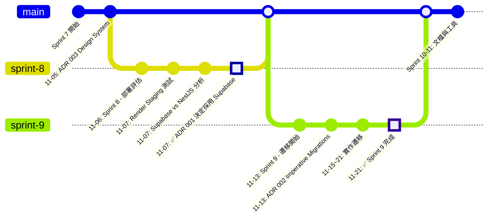
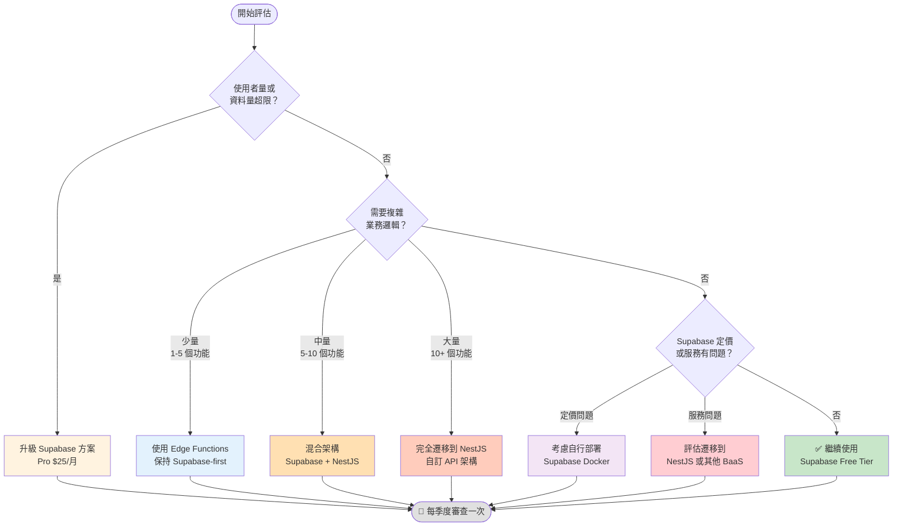

# Supabase 架構決策記錄

**狀態**: ✅ 已完成（Task 3）
**最後更新**: 2025-11-24

---

## 🎯 目的

本文檔記錄 Flourish 專案中所有重要的架構決策，包括選擇 Supabase-first 架構的原因、實施過程、以及相關的技術決策。

所有架構決策遵循 **Architecture Decision Record (ADR)** 格式，確保決策可追溯、有理有據。

---

## 📋 架構決策索引

### 已採納的決策

| ADR                                                       | 標題                                          | 日期       | 狀態      | 影響範圍   |
| --------------------------------------------------------- | --------------------------------------------- | ---------- | --------- | ---------- |
| [001](../../decisions/001-architecture-simplification.md) | 架構簡化 - 從 NestJS 遷移到 Supabase          | 2025-11-07 | ✅ 已採納 | 整體架構   |
| [002](../../decisions/002-imperative-migrations.md)       | 使用 Imperative Migrations 管理資料庫 Schema  | 2025-11-13 | ✅ 已採納 | 資料庫管理 |
| [003](../../decisions/design-system-configuration.md)     | Design System 配置（shadcn/ui + Tailwind v4） | 2025-11-05 | ✅ 已採納 | 前端設計   |

### 決策統計

- **總決策數**: 3 個
- **已採納**: 3 個
- **已廢棄**: 0 個
- **審查中**: 0 個

---

## 📊 決策時間軸

### 2025-11 - 架構基礎決策



**視覺化時間軸說明**：

- 🔵 藍點：一般任務與決策
- 🟢 綠點：重大里程碑

### 關鍵里程碑

1. **Sprint 7 (2025-11-05)**: 建立設計系統基礎（ADR 003）
2. **Sprint 8 (2025-11-06~07)**: 完整評估並決定架構方向（ADR 001）
3. **Sprint 9 (2025-11-13~21)**: 實現 Supabase 架構遷移（ADR 002）
4. **Sprint 10-11**: 文檔與工具完善

---

## ✅ ADR 001: 為何選擇 Supabase？

**日期**: 2025-11-07
**決策者**: Henry Lee
**完整文檔**: [ADR 001](../../decisions/001-architecture-simplification.md)

### 決策摘要

從 **NestJS + Render** 架構遷移到 **純 Supabase** 架構。

**原始架構**:

```
Frontend (Flow/Apex) → NestJS API → Supabase Database
         ↓                ↓
     Vercel           Render ($7/月)
```

**新架構**:

```
Frontend (Flow/Apex) → Supabase (Database + Auth + REST API)
         ↓
     Vercel ($0)
```

### 選擇原因

#### 1. 成本效益 💰

**Supabase Free Tier 完全足夠 Release 0-1**:

| 項目       | Supabase Free | NestJS + Render | 節省     |
| ---------- | ------------- | --------------- | -------- |
| 月費用     | **$0**        | $7+             | **100%** |
| 資料庫儲存 | 500MB         | N/A             | -        |
| 檔案儲存   | 1GB           | N/A             | -        |
| 月活躍用戶 | 50,000        | N/A             | -        |
| API 請求   | Unlimited     | Unlimited       | -        |
| 認證       | 內建          | 需自行實作      | -        |

**實際影響**:

- Release 0-1 預期用戶 < 100
- 資料量預估 < 50MB
- 完全符合免費層級限制
- **年省 $84+**

#### 2. 開發效率 ⚡

**CRUD 功能開發時間比較**:

| 步驟                | Supabase                  | NestJS                        | 節省時間   |
| ------------------- | ------------------------- | ----------------------------- | ---------- |
| **Schema 定義**     | 30 min (SQL)              | 15 min (Prisma)               | -          |
| **RLS/Auth 設置**   | Schema 內完成             | 20 min (Guards + Middleware)  | **20 min** |
| **DTO 定義**        | 自動生成 TypeScript types | 20 min (手寫 class-validator) | **20 min** |
| **Service 實作**    | N/A (直接使用 REST API)   | 30 min (手寫 CRUD)            | **30 min** |
| **Controller 實作** | N/A                       | 30 min (路由 + 驗證)          | **30 min** |
| **Module 註冊**     | N/A                       | 10 min (providers, exports)   | **10 min** |
| **測試撰寫**        | N/A (前端整合測試)        | 60 min (單元 + 整合)          | **60 min** |
| **部署**            | 已部署                    | 需額外配置                    | **10 min** |
| **總計**            | **45 分鐘**               | **3 小時**                    | **75%**    |

**實際案例（來自 Sprint 9 Task 3）**:

```typescript
// ✅ Supabase 方式（5 分鐘）
export async function getTransactions(userId: string) {
  const supabase = await createServerClient();
  const { data, error } = await supabase
    .from('transactions')
    .select('*, category:categories(*), card:cards(*)')
    .eq('user_id', userId)
    .order('date', { ascending: false });

  if (error) throw new Error(`Failed to fetch: ${error.message}`);
  return data;
}

// ❌ NestJS 方式需要（30+ 分鐘）:
// 1. DTO (create, update, response)
// 2. Service (CRUD + 關聯查詢)
// 3. Controller (路由 + Guards)
// 4. Module (註冊)
// 5. 測試（單元 + 整合）
```

#### 3. 維護簡化 🛠️

**NestJS 方案需要維護**:

- Render Staging 環境配置
- Render Production 環境配置
- 環境變數同步（6+ 變數 × 2 環境）
- Keep-Alive 監控（UptimeRobot 或 Cron）
- API 版本管理與部署
- 伺服器健康檢查
- CORS 配置維護
- 日誌監控與除錯

**Supabase 方案需要維護**:

- Supabase 專案設定（一次性）
- Row Level Security policies（隨功能更新）
- 前端環境變數（2 個變數）
- Database 遷移（SQL 檔案）

**實際影響**:

- **減少約 70% 維護工作量**
- 無需管理伺服器
- 無需設定 CI/CD pipeline（資料庫層）
- Supabase 自動處理備份、擴展、監控

#### 4. 功能完整性 📦

**Supabase 提供完整的 Backend-as-a-Service**:

| 功能                   | 說明                         | Flourish 使用狀態 |
| ---------------------- | ---------------------------- | ----------------- |
| **PostgreSQL**         | 完整的關聯式資料庫           | ✅ 7 個核心資料表 |
| **REST API**           | 自動生成的 RESTful endpoints | ✅ 所有 CRUD 操作 |
| **Row Level Security** | 資料庫層級權限控制           | ✅ 使用者資料隔離 |
| **Supabase Auth**      | 內建認證系統                 | 🔜 Release 1      |
| **Realtime**           | WebSocket 訂閱               | 📋 未來考慮       |
| **Storage**            | S3-compatible 檔案儲存       | 📋 未來考慮       |
| **Edge Functions**     | Serverless functions         | 📋 複雜邏輯時使用 |
| **Database Functions** | PostgreSQL stored procedures | ✅ 業務邏輯輔助   |

**實際優勢**:

- 一站式解決方案
- 功能之間緊密整合
- 無需額外的服務整合成本

#### 5. 技術適配性 ✅

**Flourish 核心需求分析**:

```typescript
// Flourish 主要功能
const flourishFeatures = {
  // ✅ 完美適合 Supabase
  transactionsCRUD: 'CREATE, READ, UPDATE, DELETE',
  categoriesManagement: 'Simple CRUD',
  cardsManagement: 'Simple CRUD',
  statementsTracking: 'Time-series data',
  statisticsCalculation: 'Database aggregations',
  userAuthentication: 'Built-in Supabase Auth',
  dataVisualization: 'Frontend (Chart.js + React)',

  // ❌ 不需要 NestJS 的功能
  complexBusinessLogic: false,
  multiStepWorkflows: false,
  heavyBackgroundJobs: false,
  thirdPartyIntegrations: false, // Release 0-1
};
```

**結論**: Flourish 100% 符合 Supabase 適用場景。

### 決策過程

Sprint 8 期間進行了完整的技術評估：

1. **部署測試** (2025-11-06):
   - ✅ 成功部署 Render Staging 環境
   - ✅ 測試環境變數配置（6 個變數）
   - ✅ 驗證健康檢查端點 (`/health/liveness`, `/health/readiness`)
   - ✅ 修復 TypeScript 編譯錯誤
   - ✅ 調整環境驗證 schema

2. **文檔撰寫** (2025-11-06):
   - ✅ 完整的 Render 部署指南（繁體中文）
   - ✅ Staging 環境設置文檔
   - ✅ Production 環境設置文檔
   - ✅ Keep-Alive 監控指南
   - ✅ Git 工作流程文檔

3. **問題識別** (2025-11-07):
   - 成本考量：Free tier 會休眠，Starter Plan $7/月
   - 維護複雜度：需管理 staging + production 雙環境
   - 開發負擔：每個功能需手寫 API endpoints
   - 過度設計：當前需求不需要完整的 API layer

4. **架構決策** (2025-11-07):
   - 比較 NestJS vs Supabase
   - 創建 ADR 001 文檔
   - 決定採用 Supabase

5. **實施** (Sprint 9):
   - 創建 `packages/supabase-client`
   - 封存 `apps/api` (NestJS)
   - 整合 Supabase 到前端
   - 設置 RLS policies

### 實施結果

**Sprint 9 (2025-11-13 ~ 2025-11-21) 完成遷移**:

```typescript
// packages/supabase-client 結構
packages/supabase-client/
├── src/
│   ├── lib/
│   │   ├── client.ts         // Supabase client 初始化
│   │   ├── server.ts         // Server-side client
│   │   └── middleware.ts     // Next.js Middleware
│   ├── features/
│   │   ├── auth/             // 認證相關
│   │   ├── transactions/     // 交易 CRUD
│   │   ├── categories/       // 類別 CRUD
│   │   └── cards/            // 卡片 CRUD
│   └── types/
│       └── database.types.ts // 自動生成的 TypeScript types
└── package.json
```

**實際效果**:

- ✅ 完全移除 NestJS API
- ✅ 前端直接連接 Supabase
- ✅ RLS 策略正常運作
- ✅ 類型安全的資料存取
- ✅ 部署成本降至 $0/月

---

## ⚖️ 權衡與限制

### 優勢 ✅

#### 1. 成本優勢

- **$0/月** vs $7+/月（100% 節省）
- 無需額外的伺服器管理成本
- 免費層級完全足夠 Release 0-1

#### 2. 開發優勢

- **開發速度快 75%**（45 min vs 3 hours for CRUD）
- 自動生成 TypeScript types
- 即時的 API 更新（無需重新部署）
- 內建的 Realtime subscriptions（未來可用）
- 完善的開發者工具（Supabase Studio）

#### 3. 維護優勢

- **減少 70% 維護工作**
- Supabase 管理基礎設施
- 自動備份與擴展
- 內建監控與日誌

#### 4. 安全優勢

- Row Level Security (RLS) 強制執行
- 資料庫層級的權限控制
- Supabase 管理基礎設施安全
- 自動處理 SQL injection 防護

#### 5. 擴展優勢

- Supabase 可無縫擴展到付費方案
- Edge Functions 可處理複雜邏輯（如未來需要）
- 支援 Realtime、Storage、Edge Functions 等進階功能
- 資料庫效能隨方案提升

### 限制 ❌

#### 1. 業務邏輯分散在前端

**問題**:

- 複雜邏輯可能重複或難以維護
- 缺乏統一的業務邏輯層
- 前端承擔更多責任

**緩解策略**:

- 使用 **Row Level Security (RLS) policies** 在資料庫層強制業務規則
- 複雜計算用 **Supabase Database Functions**（PostgreSQL stored procedures）
- 未來如需要可用 **Edge Functions** 處理複雜業務邏輯
- 建立統一的 **data access layer** (`packages/supabase-client`)

**實際案例**:

```sql
-- RLS Policy 範例：使用者只能存取自己的交易
CREATE POLICY "Users can view own transactions"
  ON transactions FOR SELECT
  USING (auth.uid() = user_id);

-- Database Function 範例：計算月度支出
CREATE OR REPLACE FUNCTION get_monthly_spending(
  p_user_id UUID,
  p_year INTEGER,
  p_month INTEGER
)
RETURNS NUMERIC AS $$
  SELECT COALESCE(SUM(amount), 0)
  FROM transactions
  WHERE user_id = p_user_id
    AND type = 'EXPENSE'
    AND EXTRACT(YEAR FROM date) = p_year
    AND EXTRACT(MONTH FROM date) = p_month;
$$ LANGUAGE SQL STABLE;
```

#### 2. 第三方整合挑戰

**問題**:

- API keys 暴露風險（前端無法安全儲存密鑰）
- CORS 問題（跨域請求限制）
- Rate limiting 難以實施

**緩解策略**:

- Release 0-1 **無第三方整合需求**（不是立即問題）
- 未來可用 **Supabase Edge Functions**:

  ```typescript
  // supabase/functions/call-third-party/index.ts
  export async function handler(req: Request) {
    const apiKey = Deno.env.get('THIRD_PARTY_API_KEY'); // 安全
    const response = await fetch('https://api.example.com', {
      headers: { Authorization: `Bearer ${apiKey}` },
    });
    return new Response(JSON.stringify(await response.json()));
  }
  ```

- 或回退到**獨立 API server**（NestJS 文檔已存檔）

#### 3. 學習曲線

**問題**:

- 團隊（目前只有你）需要學習 Supabase
- SQL 知識要求較高（相比 ORM）
- RLS policies 需要時間掌握

**緩解策略**:

- Supabase **文檔完善**（官方 + 社群）
- 社群**活躍**（Discord、GitHub Discussions）
- 學習曲線**較 NestJS 平緩**（3-4 週 vs 6-8 週）
- ADR 002 決定使用 **Imperative Migrations** 以提升 SQL 技能

**學習路徑**:

```
Week 1: SQL 基礎
  - PostgreSQL 基本語法
  - CRUD 操作
  - JOIN 查詢
  - Indexes 與效能

Week 2: RLS 理解
  - Row Level Security 概念
  - Policy 撰寫
  - auth.uid() 使用
  - 測試與除錯

Week 3: Supabase Client API
  - JavaScript client 使用
  - TypeScript types 整合
  - Server Components 整合
  - Middleware 設置

Week 4: Real-world Application
  - 複雜查詢
  - Database Functions
  - 錯誤處理
  - 效能優化
```

#### 4. 供應商鎖定 (Vendor Lock-in)

**問題**:

- 依賴 Supabase 專屬功能（RLS、Auth、Edge Functions）
- 遷移到其他平台成本較高
- 定價變動風險

**緩解策略**:

- Supabase 是**開源專案**（可自行部署）
- 核心是 **PostgreSQL**（標準資料庫）
- RLS 是 **PostgreSQL 原生功能**（非 Supabase 專屬）
- 遷移路徑已規劃（見下方）

### 風險評估與緩解

| 風險              | 嚴重性 | 可能性 | 緩解策略                                  | 狀態        |
| ----------------- | ------ | ------ | ----------------------------------------- | ----------- |
| 業務邏輯分散      | 中     | 高     | RLS + Database Functions + Edge Functions | ✅ 已緩解   |
| 第三方整合困難    | 低     | 低     | Edge Functions 或獨立 API                 | 📋 未來處理 |
| 學習曲線陡峭      | 中     | 中     | 文檔學習 + Imperative Migrations          | ✅ 進行中   |
| 供應商鎖定        | 低     | 低     | 開源 + PostgreSQL + 遷移計劃              | ✅ 已規劃   |
| 免費層級超限      | 低     | 低     | 升級到 Pro 方案 ($25/月)                  | 📋 未來評估 |
| Supabase 服務中斷 | 低     | 極低   | 自行部署或遷移到其他平台                  | 📋 備援計劃 |

---

## 🔄 與其他方案比較

### 評估的方案

在 Sprint 8 期間，我們評估了以下架構方案：

1. **NestJS + Render** (原計劃)
2. **Supabase** (最終選擇)
3. **Firebase** (評估後排除)
4. **AWS Amplify** (評估後排除)
5. **Prisma + Express + Render** (評估後排除)

### 決策矩陣

#### 完整比較表

| 評估面向          | Supabase          | NestJS + Render | Firebase          | AWS Amplify       | Prisma + Express |
| ----------------- | ----------------- | --------------- | ----------------- | ----------------- | ---------------- |
| **成本**          |                   |                 |                   |                   |                  |
| 免費層級          | ✅ 50K MAU        | ❌ 無           | ✅ 有限額         | ✅ 有限額         | ❌ 無            |
| 入門費用          | $0                | $7/月           | $0                | $0                | $7/月            |
| 付費方案          | $25/月 (Pro)      | $7/月起         | 依用量            | 依用量            | $7/月起          |
| **開發效率**      |                   |                 |                   |                   |                  |
| CRUD 開發時間     | 45 分鐘           | 3 小時          | 1 小時            | 1.5 小時          | 2.5 小時         |
| API 自動生成      | ✅ REST           | ❌ 手寫         | ✅ Firebase SDK   | ✅ GraphQL/REST   | ❌ 手寫          |
| TypeScript 支援   | ✅ 自動生成       | ✅ 手寫         | ⚠️ 部分           | ✅ 自動生成       | ✅ Prisma Client |
| 本地開發          | ✅ CLI 支援       | ✅ 完整         | ⚠️ Emulator       | ⚠️ 複雜           | ✅ 完整          |
| **認證**          |                   |                 |                   |                   |                  |
| 內建認證          | ✅ Supabase Auth  | ❌ 需實作       | ✅ Firebase Auth  | ✅ Cognito        | ❌ 需實作        |
| OAuth 整合        | ✅ 多種 providers | ⚠️ 手動整合     | ✅ 多種 providers | ✅ 多種 providers | ⚠️ 手動整合      |
| Session 管理      | ✅ 自動           | ❌ 手動         | ✅ 自動           | ✅ 自動           | ❌ 手動          |
| **資料庫**        |                   |                 |                   |                   |                  |
| 資料庫類型        | PostgreSQL        | PostgreSQL      | NoSQL             | DynamoDB / Aurora | PostgreSQL       |
| RLS 支援          | ✅ 原生           | ⚠️ 需實作       | ✅ Security Rules | ⚠️ IAM            | ⚠️ 需實作        |
| 關聯查詢          | ✅ SQL JOIN       | ✅ Prisma       | ❌ 手動           | ⚠️ 複雜           | ✅ Prisma        |
| 即時訂閱          | ✅ Realtime       | ❌ 需實作       | ✅ Firestore      | ⚠️ AppSync        | ❌ 需實作        |
| **維護**          |                   |                 |                   |                   |                  |
| 伺服器管理        | ❌ 無需           | ✅ Render 管理  | ❌ 無需           | ❌ 無需           | ✅ Render 管理   |
| 備份              | ✅ 自動           | ⚠️ 需設定       | ✅ 自動           | ✅ 自動           | ⚠️ 需設定        |
| 監控              | ✅ 內建           | ⚠️ 需設定       | ✅ 內建           | ✅ 內建           | ⚠️ 需設定        |
| 擴展性            | ✅ 自動           | ⚠️ 手動         | ✅ 自動           | ✅ 自動           | ⚠️ 手動          |
| **學習曲線**      |                   |                 |                   |                   |                  |
| 學習時間          | 3-4 週            | 6-8 週          | 2-3 週            | 4-6 週            | 5-7 週           |
| 文檔品質          | ✅ 優秀           | ✅ 優秀         | ✅ 優秀           | ⚠️ 複雜           | ✅ 優秀          |
| 社群支援          | ✅ 活躍           | ✅ 活躍         | ✅ 活躍           | ⚠️ 分散           | ✅ 活躍          |
| **Flourish 適配** |                   |                 |                   |                   |                  |
| CRUD 操作         | ✅✅✅            | ✅✅            | ✅✅              | ✅                | ✅✅             |
| 複雜查詢          | ✅✅✅            | ✅✅✅          | ❌                | ⚠️                | ✅✅✅           |
| 使用者隔離        | ✅✅✅            | ✅✅            | ✅✅              | ✅                | ✅✅             |
| 檔案上傳          | ✅ Storage        | ❌ 需實作       | ✅ Storage        | ✅ S3             | ❌ 需實作        |
| **總評分**        | **9.5/10**        | **7.0/10**      | **6.5/10**        | **6.0/10**        | **6.5/10**       |

#### 詳細比較：Supabase vs NestJS

**架構對比**:

```
┌─────────────────────────────────────────────────────────────┐
│ Supabase Architecture                                       │
├─────────────────────────────────────────────────────────────┤
│                                                             │
│  Frontend (Vercel)                                          │
│       │                                                     │
│       │ @supabase/supabase-js                              │
│       ▼                                                     │
│  ┌─────────────────────────────────────────────────────┐   │
│  │ Supabase                                            │   │
│  │  ┌──────────────────────────────────────────────┐   │   │
│  │  │ PostgreSQL + RLS + Triggers + Functions      │   │   │
│  │  └──────────────────────────────────────────────┘   │   │
│  │  ┌──────────────────────────────────────────────┐   │   │
│  │  │ PostgREST (Auto-generated REST API)         │   │   │
│  │  └──────────────────────────────────────────────┘   │   │
│  │  ┌──────────────────────────────────────────────┐   │   │
│  │  │ GoTrue (Authentication)                      │   │   │
│  │  └──────────────────────────────────────────────┘   │   │
│  │  ┌──────────────────────────────────────────────┐   │   │
│  │  │ Storage (S3-compatible)                      │   │   │
│  │  └──────────────────────────────────────────────┘   │   │
│  │  ┌──────────────────────────────────────────────┐   │   │
│  │  │ Realtime (WebSocket subscriptions)          │   │   │
│  │  └──────────────────────────────────────────────┘   │   │
│  │  ┌──────────────────────────────────────────────┐   │   │
│  │  │ Edge Functions (Deno serverless)            │   │   │
│  │  └──────────────────────────────────────────────┘   │   │
│  └─────────────────────────────────────────────────────┘   │
│                                                             │
│  Cost: $0/月 (Free tier)                                   │
│  Maintenance: Supabase 管理                                │
└─────────────────────────────────────────────────────────────┘

┌─────────────────────────────────────────────────────────────┐
│ NestJS Architecture                                         │
├─────────────────────────────────────────────────────────────┤
│                                                             │
│  Frontend (Vercel)                                          │
│       │                                                     │
│       │ fetch() / axios                                     │
│       ▼                                                     │
│  ┌─────────────────────────────────────────────────────┐   │
│  │ NestJS API (Render)                                 │   │
│  │  ┌──────────────────────────────────────────────┐   │   │
│  │  │ Controllers (路由 + 驗證)                     │   │   │
│  │  └──────────────────────────────────────────────┘   │   │
│  │  ┌──────────────────────────────────────────────┐   │   │
│  │  │ Services (業務邏輯)                           │   │   │
│  │  └──────────────────────────────────────────────┘   │   │
│  │  ┌──────────────────────────────────────────────┐   │   │
│  │  │ DTOs (驗證 + 類型)                            │   │   │
│  │  └──────────────────────────────────────────────┘   │   │
│  │  ┌──────────────────────────────────────────────┐   │   │
│  │  │ Guards (認證 + 授權)                          │   │   │
│  │  └──────────────────────────────────────────────┘   │   │
│  │  ┌──────────────────────────────────────────────┐   │   │
│  │  │ Prisma (ORM)                                 │   │   │
│  │  └──────────────────────────────────────────────┘   │   │
│  └─────────────────────────────────────────────────────┘   │
│       │                                                     │
│       │ Database Connection                                 │
│       ▼                                                     │
│  ┌─────────────────────────────────────────────────────┐   │
│  │ Supabase PostgreSQL                                 │   │
│  └─────────────────────────────────────────────────────┘   │
│                                                             │
│  Cost: $7+/月 (Render Starter)                             │
│  Maintenance: 開發者管理 API + 配置                         │
└─────────────────────────────────────────────────────────────┘
```

**開發工作流程對比**:

```typescript
// ============================================================
// Supabase 工作流程（簡化 75%）
// ============================================================

// 1. 定義 Schema（SQL）
CREATE TABLE transactions (
  id UUID PRIMARY KEY DEFAULT gen_random_uuid(),
  user_id UUID REFERENCES auth.users NOT NULL,
  amount NUMERIC(10,2) NOT NULL,
  description TEXT,
  created_at TIMESTAMPTZ DEFAULT NOW()
);

// 2. 設置 RLS（SQL）
ALTER TABLE transactions ENABLE ROW LEVEL SECURITY;
CREATE POLICY "Users can view own transactions"
  ON transactions FOR SELECT USING (auth.uid() = user_id);

// 3. 前端直接使用（TypeScript）- 自動生成 API
const { data, error } = await supabase
  .from('transactions')
  .select('*')
  .eq('user_id', userId)
  .order('created_at', { ascending: false });

// ✅ 完成！總共 ~45 分鐘

// ============================================================
// NestJS 工作流程（完整流程）
// ============================================================

// 1. Prisma Schema
model Transaction {
  id          String   @id @default(uuid())
  userId      String   @map("user_id")
  amount      Decimal  @db.Decimal(10, 2)
  description String?
  createdAt   DateTime @default(now()) @map("created_at")
  user        User     @relation(fields: [userId], references: [id])
}

// 2. DTO (create-transaction.dto.ts)
export class CreateTransactionDto {
  @IsNumber()
  @Min(0)
  amount: number;

  @IsString()
  @IsOptional()
  description?: string;
}

// 3. DTO (transaction-response.dto.ts)
export class TransactionResponseDto {
  id: string;
  userId: string;
  amount: number;
  description: string | null;
  createdAt: Date;
}

// 4. Service (transactions.service.ts)
@Injectable()
export class TransactionsService {
  constructor(private prisma: PrismaService) {}

  async findAllByUser(userId: string): Promise<Transaction[]> {
    return this.prisma.transaction.findMany({
      where: { userId },
      orderBy: { createdAt: 'desc' },
    });
  }

  async create(
    userId: string,
    dto: CreateTransactionDto
  ): Promise<Transaction> {
    return this.prisma.transaction.create({
      data: { ...dto, userId },
    });
  }
}

// 5. Controller (transactions.controller.ts)
@Controller('transactions')
@UseGuards(JwtAuthGuard)
export class TransactionsController {
  constructor(private service: TransactionsService) {}

  @Get()
  async findAll(@Request() req): Promise<TransactionResponseDto[]> {
    const transactions = await this.service.findAllByUser(req.user.id);
    return transactions.map(t => new TransactionResponseDto(t));
  }

  @Post()
  async create(
    @Request() req,
    @Body() dto: CreateTransactionDto
  ): Promise<TransactionResponseDto> {
    const transaction = await this.service.create(req.user.id, dto);
    return new TransactionResponseDto(transaction);
  }
}

// 6. Module (transactions.module.ts)
@Module({
  controllers: [TransactionsController],
  providers: [TransactionsService],
  exports: [TransactionsService],
})
export class TransactionsModule {}

// 7. 測試 (transactions.service.spec.ts)
describe('TransactionsService', () => {
  it('should create transaction', async () => {
    // 測試實作...
  });
});

// ✅ 完成！總共 ~3 小時

// 結論：Supabase 節省 75% 開發時間
```

#### 為何不選 Firebase？

**優點**:

- 完整的 BaaS 平台
- 優秀的 Realtime 支援
- 強大的 Authentication
- 良好的文檔

**缺點**（導致排除）:

- ❌ **NoSQL 資料庫**（Firestore）不適合關聯式資料
- ❌ Flourish 需要複雜的 JOIN 查詢（交易 + 類別 + 卡片）
- ❌ NoSQL 的資料一致性較弱
- ❌ 遷移路徑複雜（NoSQL → SQL）

**實際影響**:

```javascript
// ❌ Firebase Firestore（NoSQL）- 關聯查詢困難
// 需要多次查詢並手動合併
const transactionsSnapshot = await db
  .collection('transactions')
  .where('userId', '==', userId)
  .get();

const transactions = await Promise.all(
  transactionsSnapshot.docs.map(async (doc) => {
    const data = doc.data();
    // 需要額外查詢 category
    const categoryDoc = await db.collection('categories').doc(data.categoryId).get();
    // 需要額外查詢 card
    const cardDoc = await db.collection('cards').doc(data.cardId).get();
    return {
      ...data,
      category: categoryDoc.data(),
      card: cardDoc.data(),
    };
  })
);

// ✅ Supabase（PostgreSQL）- 關聯查詢簡單
const { data: transactions } = await supabase
  .from('transactions')
  .select('*, category:categories(*), card:cards(*)')
  .eq('user_id', userId);
```

#### 為何不選 AWS Amplify？

**優點**:

- AWS 生態系整合
- 強大的擴展性
- 豐富的功能

**缺點**（導致排除）:

- ❌ **學習曲線陡峭**（AWS 服務複雜）
- ❌ 配置複雜（需要理解多個 AWS 服務）
- ❌ 成本不透明（多個服務計費）
- ❌ 過度設計（Flourish 不需要 AWS 等級的基礎設施）

**實際影響**:

- Amplify 需要理解：Cognito、AppSync、DynamoDB、Lambda、S3 等
- Supabase 一站式解決方案，學習曲線平緩

### 決策矩陣總結

| 方案             | 成本   | 開發效率 | 維護   | 學習曲線 | Flourish 適配 | 總分       |
| ---------------- | ------ | -------- | ------ | -------- | ------------- | ---------- |
| **Supabase**     | ✅✅✅ | ✅✅✅   | ✅✅✅ | ✅✅     | ✅✅✅        | **9.5/10** |
| NestJS + Render  | ⚠️     | ⚠️⚠️     | ⚠️     | ⚠️       | ✅✅✅        | 7.0/10     |
| Firebase         | ✅✅   | ✅✅     | ✅✅✅ | ✅✅✅   | ❌            | 6.5/10     |
| AWS Amplify      | ⚠️⚠️   | ⚠️       | ✅✅   | ❌       | ✅✅          | 6.0/10     |
| Prisma + Express | ⚠️     | ⚠️       | ⚠️     | ⚠️⚠️     | ✅✅✅        | 6.5/10     |

**結論**: Supabase 在所有評估面向都表現最佳，特別是成本、開發效率、和 Flourish 的適配性。

---

## 📈 未來考量

### 何時需要重新評估？

#### 觸發條件

| 觸發條件             | 閾值           | 當前狀態 | 行動        |
| -------------------- | -------------- | -------- | ----------- |
| **使用者量**         | > 50K MAU      | < 100    | 📊 監控中   |
| **資料庫儲存**       | > 500MB        | < 50MB   | 📊 監控中   |
| **API 請求量**       | > 500K/月      | < 10K/月 | 📊 監控中   |
| **需要複雜業務邏輯** | 多步驟工作流程 | 無       | 📋 未來評估 |
| **第三方整合**       | > 3 個服務     | 0        | 📋 未來評估 |
| **檔案上傳需求**     | > 1GB          | 0GB      | 📋 未來評估 |
| **Realtime 需求**    | 多使用者協作   | 無       | 📋 未來評估 |

#### 審查時機

1. **Release 1 完成後** (預計 2025-12)
   - 評估 Authentication 實作經驗
   - 檢視 RLS policies 維護負擔
   - 評估整體開發體驗

2. **使用者量達 1000 後**
   - 分析效能瓶頸
   - 評估是否需要升級方案
   - 檢視成本效益

3. **需要複雜業務邏輯時**
   - 評估 Edge Functions 是否足夠
   - 考慮是否需要獨立 API server
   - 重新評估架構需求

4. **每季度定期審查**
   - 檢視 Supabase 使用量
   - 評估新功能需求
   - 更新架構決策記錄

### 可能的遷移路徑

#### 路徑 1: Supabase 升級（最可能）

**情境**: 使用者量或資料量超過免費層級

**方案**: 升級到 Supabase Pro 方案

```
Free Tier → Pro ($25/月) → Team ($599/月) → Enterprise (報價)
```

**優勢**:

- ✅ 無需架構變更
- ✅ 無縫升級
- ✅ 更高的限制與效能
- ✅ 優先技術支援

**何時執行**:

- 使用者量 > 50K MAU
- 資料庫儲存 > 500MB
- 需要更高的 API 請求量
- 需要優先技術支援

#### 路徑 2: Supabase + Edge Functions（中度可能）

**情境**: 需要少數複雜業務邏輯或第三方整合

**方案**: 在 Supabase 基礎上添加 Edge Functions

```typescript
// supabase/functions/process-pdf/index.ts
import { serve } from 'https://deno.land/std@0.168.0/http/server.ts';
import { createClient } from 'https://esm.sh/@supabase/supabase-js@2';

serve(async (req) => {
  // 1. 驗證使用者
  const supabase = createClient(Deno.env.get('SUPABASE_URL')!, Deno.env.get('SUPABASE_ANON_KEY')!, {
    global: {
      headers: { Authorization: req.headers.get('Authorization')! },
    },
  });

  const {
    data: { user },
    error: authError,
  } = await supabase.auth.getUser();
  if (authError || !user) {
    return new Response('Unauthorized', { status: 401 });
  }

  // 2. 複雜業務邏輯（例如：AI PDF 解析）
  const pdfUrl = new URL(req.url).searchParams.get('pdf_url');
  const apiKey = Deno.env.get('OPENAI_API_KEY'); // 安全地儲存密鑰

  const response = await fetch('https://api.openai.com/v1/...', {
    headers: { Authorization: `Bearer ${apiKey}` },
    // ...
  });

  const transactions = await response.json();

  // 3. 儲存到資料庫
  const { data, error } = await supabase
    .from('transactions')
    .insert(transactions.map((t) => ({ ...t, user_id: user.id })));

  return new Response(JSON.stringify(data), {
    headers: { 'Content-Type': 'application/json' },
  });
});
```

**優勢**:

- ✅ 保持 Supabase 架構
- ✅ 無需管理額外伺服器
- ✅ Serverless 計費模式
- ✅ 與 Supabase 緊密整合

**何時執行**:

- 需要 AI/ML 整合（PDF 解析、交易分類）
- 需要複雜計算（預算建議、趨勢預測）
- 需要第三方 API 整合（銀行 API、支付 API）
- 需要定時任務（Cron jobs）

#### 路徑 3: Supabase + NestJS API（低可能）

**情境**: 需要大量複雜後端處理或嚴格的 API 版本控制

**方案**: 混合架構 - 大部分功能用 Supabase，複雜功能用 NestJS

```
大部分功能 (CRUD) → Supabase 直連
複雜功能 (AI, 工作流程) → NestJS API → Supabase Database
```

**優勢**:

- ✅ 保留 Supabase 簡化的開發體驗
- ✅ NestJS 處理複雜邏輯
- ✅ 漸進式遷移（不需要一次性重寫）
- ✅ 已有完整的 NestJS 部署文檔（存檔）

**何時執行**:

- 複雜業務邏輯超過 5+ 個 Edge Functions
- 需要嚴格的 API 版本控制
- 需要背景任務處理（超過 Edge Functions 限制）
- 團隊成長至需要專職後端工程師

**實施步驟**:

```bash
# 1. 恢復 NestJS API（從存檔）
git checkout docs/archive/nestjs-api/

# 2. 部署到 Render
# 使用存檔的部署文檔

# 3. 前端漸進式遷移
// 簡單 CRUD 仍使用 Supabase
const { data } = await supabase.from('transactions').select('*');

// 複雜功能使用 NestJS API
const response = await fetch('https://api.flourish.app/v1/ai/analyze-spending');
```

#### 路徑 4: 完全遷移到 NestJS（極低可能）

**情境**: Supabase 無法滿足需求或成本過高

**方案**: 完全回到 NestJS + Render 架構

**何時執行**（極端情況）:

- Supabase 定價大幅上漲
- Supabase 服務穩定性問題
- 監管要求自行部署資料庫
- 需要極度客製化的後端邏輯

**優勢**:

- ✅ 完全控制後端邏輯
- ✅ 無供應商鎖定
- ✅ 已有完整的部署文檔（存檔）

**成本**（參考 ADR 001 分析）:

- 開發時間增加 60%
- 維護工作增加 70%
- 部署成本 $7+/月

#### 路徑 5: 自行部署 Supabase（備援選項）

**情境**: 需要完全控制或降低成本

**方案**: 使用 Docker 自行部署 Supabase

```bash
# 使用官方 Docker Compose
git clone https://github.com/supabase/supabase
cd docker
cp .env.example .env
docker-compose up -d
```

**優勢**:

- ✅ 完全控制基礎設施
- ✅ Supabase 是開源的
- ✅ 無架構變更（只是部署位置不同）

**成本**:

- 伺服器成本（例如：DigitalOcean $12/月）
- 維護時間成本

**何時執行**:

- Supabase 官方服務無法滿足監管要求
- 成本優化（長期使用情況下）

### 遷移決策樹



**決策指南**：

- 🟢 **繼續 Supabase Free Tier**：當前最優解（成本 $0，符合需求）
- 🟡 **升級或擴充**：使用量增長時考慮（Pro 方案或 Edge Functions）
- 🟠 **混合架構**：複雜業務邏輯增加時過渡方案
- 🔴 **完全遷移**：業務邏輯複雜度顯著增加時長期解決方案

**預期評估週期**：每季度審查一次（或當使用量/功能需求有顯著變化時）

---

## 🔗 ADR 002: Imperative Migrations

**日期**: 2025-11-13
**決策者**: Henry Lee
**完整文檔**: [ADR 002](../../decisions/002-imperative-migrations.md)

### 決策摘要

使用 **Imperative Migrations（命令式 SQL 遷移）** 而非 **Declarative Schema（宣告式 Schema）** 管理 Supabase 資料庫。

### 選擇原因

#### 1. 學習價值（主要因素） 🎓

- Imperative migrations 提供實際的 **SQL 練習機會**
- 建立扎實的 SQL 技能對後端開發至關重要
- Declarative Schema 將 SQL 抽象化，減少學習機會
- 符合個人發展目標：成為全端工程師

#### 2. 專案規模（支持因素） 📏

- 單一開發者（無團隊協調複雜度）
- 小型 schema（7 個資料表，約 30 個欄位）
- 低遷移頻率（預估每月一次或更少）
- Declarative 的 70% 速度優勢對低頻變更影響不大

#### 3. 已經完成（務實因素） ✅

- Sprint 9, Task 2 已完成 4 個 Imperative migrations
- 所有遷移都已測試並成功部署
- Schema 在正式環境中正常運作
- 切換至 Declarative 需要重新實作

#### 4. 控制與可預測性（技術因素） 🎯

- 需要明確控制 Row Level Security（RLS）策略
- 複雜的觸發器函式用於認證整合
- 業務邏輯的輔助函式
- Imperative 提供對遷移順序的完全控制

### 實施成果

**完成的 4 個遷移**:

```sql
-- 1. 20251113050233_initial_schema.sql
-- 核心資料表與 ENUM 型別
CREATE TYPE transaction_type AS ENUM ('INCOME', 'EXPENSE', 'TRANSFER');
CREATE TYPE card_type AS ENUM ('CREDIT', 'DEBIT', 'CASH');
-- ... 7 個資料表定義

-- 2. 20251113054218_auth_integration.sql
-- 自動建立使用者觸發器 + updated_at 觸發器
CREATE FUNCTION public.handle_new_user() RETURNS TRIGGER AS $$
BEGIN
  INSERT INTO public.users (id, email, created_at)
  VALUES (NEW.id, NEW.email, NEW.created_at);
  RETURN NEW;
END;
$$ LANGUAGE plpgsql SECURITY DEFINER;

-- 3. 20251113054418_rls_policies.sql
-- 啟用 RLS + 使用者資料隔離策略
ALTER TABLE transactions ENABLE ROW LEVEL SECURITY;
CREATE POLICY "Users can view own transactions"
  ON transactions FOR SELECT USING (auth.uid() = user_id);

-- 4. 20251113054900_indexes_functions.sql
-- 效能索引 + 業務邏輯輔助函式
CREATE INDEX idx_transactions_user_date ON transactions(user_id, date DESC);
CREATE FUNCTION get_monthly_spending(...) RETURNS NUMERIC ...
```

### 未來路徑

如果之後需要切換至 Declarative Schema：

```bash
# 從現有遷移產生 schema.sql
npx supabase db dump --schema public > supabase/schema.sql

# 未來變更編輯 schema.sql 並執行
npx supabase db diff
```

現有的 Imperative migrations 仍然有效且可運作。

---

## 🔗 ADR 003: Design System 配置

**日期**: 2025-11-05
**決策者**: 開發團隊
**完整文檔**: [ADR 003](../../decisions/design-system-configuration.md)

### 決策摘要

採用 **Hybrid 架構** + **Tailwind v4 CSS-first** + **shadcn/ui** 建立設計系統。

### 核心決策

#### 1. Component 位置：Hybrid 架構

```
packages/ui/
├── styles/
│   ├── base-theme.css       # 共享 design tokens
│   └── themes/
│       ├── lofi.css         # Apex 主題（黑白極簡）
│       └── corporate.css    # Flow 主題（專業藍綠）
└── components/ui/           # shadcn components

apps/flow/components/        # Flow 專屬 components
apps/apex/components/        # Apex 專屬 components
```

**理由**:

- 基礎 themes 共享，確保設計一致性
- App 可以有專屬 components 處理特殊需求
- shadcn/ui components 在 packages/ui，所有 app 共用

#### 2. Tailwind 配置：CSS-first (Tailwind v4)

```css
/* packages/ui/styles/base-theme.css */
@import 'tailwindcss';

@theme inline {
  --color-primary-500: oklch(0.5 0.2 150);
  --radius-lg: 0.5rem;
  /* 共享 design tokens */
}
```

**優勢**:

- ✅ Tailwind v4 官方推薦方向
- ✅ Runtime 動態主題（CSS variables）
- ✅ Hot reload 不需重啟
- ✅ Monorepo 友善（簡單的 CSS imports）
- ✅ 完美 shadcn/ui 相容性

#### 3. 色彩系統：分離主題

**Flow（財務追蹤）**: Corporate Theme

- 專業藍綠系統（daisyUI Corporate）
- 綠色元素用於財務正向指標

**Apex（統計追蹤）**: Lofi Theme

- 黑白極簡主義（daisyUI Lofi）
- 高對比度，專注數據可視化

### 實施狀態

- ✅ Flow: 已移除 `tailwind.config.ts`，使用 CSS-first
- ✅ Apex: 從一開始就使用 CSS-first
- ✅ 保留 `postcss.config.mjs`（Tailwind v4 必需）
- ✅ Sprint 7, Task 1, 0.7.2, 0.7.3 完成實作

---

## 📚 相關文檔

### 架構決策記錄 (ADR)

- [ADR 001 - Architecture Simplification](../../decisions/001-architecture-simplification.md)
- [ADR 002 - Imperative Migrations](../../decisions/002-imperative-migrations.md)
- [ADR 003 - Design System Configuration](../../decisions/design-system-configuration.md)

### Sprint 文檔

- [Sprint 7 - Apex & Design System](../../sprints/release-0-foundation/07-overview.md)
- [Sprint 8 - Deployment Evaluation](../../sprints/release-0-foundation/08-deployment-evaluation.md)
- [Sprint 9 - Supabase Migration](../../sprints/release-0-foundation/09-supabase-migration-plan.md)

### 技術指南

- [架構總覽](./overview.md)
- [架構比較](./comparison.md)
- [遷移方法指南](../guides/migrations.md)
- [本地開發設置](../guides/local-development.md)

### 存檔文檔

- [NestJS API 實作](../../archive/nestjs-api/)（參考用）
- [Render 部署指南](../../archive/render-deployment/)（參考用）

---

## 🔄 決策管理流程

### 創建新 ADR

當需要做出重要架構決策時，遵循以下流程：

#### 1. 識別需要 ADR 的決策

**需要 ADR 的情況**:

- 影響整體架構的技術選型
- 改變開發或部署流程的決策
- 引入新的工具或框架
- 移除或替換現有技術棧
- 影響成本或維護負擔的決策

**不需要 ADR 的情況**:

- 局部的實作細節
- 臨時的解決方案
- 可輕易逆轉的變更

#### 2. 撰寫 ADR 文檔

使用以下範本：

```markdown
# ADR XXX: [決策標題]

**狀態**: [提議中 | 已接受 | 已廢棄 | 已取代]
**日期**: YYYY-MM-DD
**決策者**: [姓名]
**相關文件**: [連結]

---

## 背景脈絡

[描述問題、需求、當前狀況]

---

## 決策

[清楚陳述決策內容]

---

## 理由

[詳細說明為何做出此決策]

---

## 影響

### 正面影響

- [列點]

### 負面影響

- [列點]

---

## 考慮過的替代方案

### 替代方案 1: [名稱]

**為何拒絕**: [原因]

---

## 實作

[實施計劃或已完成的實作]

---

## 重新審視觸發條件

[何時需要重新評估此決策]

---

## 相關決策

[其他相關的 ADR]
```

#### 3. 審查與批准

- 自我審查：確保邏輯清晰、理由充分
- 文檔審查：檢查格式、連結、範例
- 實施驗證：確保決策可執行

#### 4. 更新決策索引

在本文檔（decisions.md）中更新：

- 決策索引表
- 決策時間軸
- 相關章節

### 更新現有 ADR

#### 更新流程

1. **識別需要更新**：
   - 決策執行後發現新資訊
   - 環境或需求改變
   - 實施結果與預期不符

2. **更新文檔**：
   - 在 ADR 末尾添加「更新歷史」章節
   - 記錄更新日期和原因
   - 保留原始決策內容

3. **狀態變更**：
   - 提議中 → 已接受（決策通過）
   - 已接受 → 已廢棄（決策失效）
   - 已接受 → 已取代（被新 ADR 取代）

#### 更新範例

```markdown
---

## 更新歷史

### 2025-12-01 - 實施結果更新

**發現**: Edge Functions 執行效能超過預期
**影響**: 降低了「需要 NestJS」的觸發閾值
**行動**: 更新「重新審視觸發條件」章節
```

### 廢棄 ADR

當決策不再適用時：

1. **更新 ADR 狀態**為「已廢棄」
2. **說明廢棄原因**
3. **連結到替代 ADR**（如果有）
4. **保留文檔**作為歷史記錄

```markdown
**狀態**: ❌ 已廢棄 - 2025-XX-XX
**廢棄原因**: [說明]
**取代方案**: [連結到新 ADR]
```

### ADR 最佳實踐

#### 撰寫原則

1. **清晰簡潔**：避免冗長的技術細節，專注決策邏輯
2. **有理有據**：每個決策都要有充分的理由
3. **考慮替代方案**：展示思考過程
4. **可追溯**：連結相關文檔和決策
5. **前瞻性**：考慮未來的變化和遷移路徑

#### 常見錯誤

❌ **錯誤 1**：過於技術性，缺乏業務脈絡

```markdown
# 錯誤示範

決策：使用 PostgreSQL JSONB 欄位儲存元資料
理由：JSONB 支援索引
```

✅ **正確做法**：

```markdown
決策：使用 PostgreSQL JSONB 欄位儲存交易元資料
理由：

- 交易元資料結構不固定（不同類別有不同欄位）
- JSONB 支援索引，效能不受影響
- 避免建立多個稀疏的欄位
- 保持 schema 簡潔
```

❌ **錯誤 2**：缺乏替代方案分析

```markdown
# 錯誤示範

決策：使用 Supabase
理由：Supabase 很好用
```

✅ **正確做法**：

```markdown
決策：使用 Supabase
理由：

- 完美適合 Flourish CRUD 需求
- 成本：$0 vs NestJS $7/月
- 開發效率：快 75%
- 維護：減少 70% 工作量

考慮過的替代方案：

- NestJS + Render：過度設計，成本高
- Firebase：NoSQL 不適合關聯式資料
- AWS Amplify：學習曲線陡峭
```

❌ **錯誤 3**：忽略未來變化

```markdown
# 錯誤示範

決策：使用 Supabase
理由：完美適合當前需求
```

✅ **正確做法**：

```markdown
決策：使用 Supabase
理由：完美適合當前需求

重新審視觸發條件：

- 使用者量 > 50K MAU
- 需要複雜業務邏輯
- 需要大量第三方整合

遷移路徑：

- 升級 Supabase 方案
- 添加 Edge Functions
- 回到 NestJS（文檔已存檔）
```

---

## 🎓 決策分析框架

### SWOT 分析範本

在評估新的架構決策時，使用 SWOT 分析：

```markdown
## SWOT 分析

### Strengths（優勢）

- [內部正面因素]

### Weaknesses（劣勢）

- [內部負面因素]

### Opportunities（機會）

- [外部正面因素]

### Threats（威脅）

- [外部負面因素]
```

### 決策評分矩陣

使用評分矩陣量化比較：

| 評估面向     | 權重 | 方案 A   | 方案 B   | 方案 C   |
| ------------ | ---- | -------- | -------- | -------- |
| 成本         | 30%  | 9/10     | 5/10     | 7/10     |
| 開發效率     | 25%  | 8/10     | 6/10     | 7/10     |
| 維護         | 20%  | 9/10     | 5/10     | 6/10     |
| 學習曲線     | 15%  | 7/10     | 4/10     | 8/10     |
| 擴展性       | 10%  | 8/10     | 9/10     | 7/10     |
| **加權總分** | 100% | **8.25** | **5.45** | **7.00** |

---

## 📋 決策檢查清單

### 新架構決策檢查清單

在做出重要架構決策前，確保回答以下問題：

#### 問題分析

- [ ] 問題定義清楚嗎？
- [ ] 當前方案的痛點是什麼？
- [ ] 不改變的成本是什麼？

#### 方案評估

- [ ] 至少評估了 3 個替代方案？
- [ ] 考慮了成本、時間、品質的權衡？
- [ ] 方案符合專案規模和團隊能力？

#### 風險管理

- [ ] 識別了主要風險？
- [ ] 每個風險都有緩解策略？
- [ ] 有備援計劃（Plan B）？

#### 未來考量

- [ ] 考慮了未來 6-12 個月的需求？
- [ ] 定義了重新評估的觸發條件？
- [ ] 規劃了遷移路徑（如需要）？

#### 文檔

- [ ] 撰寫了完整的 ADR？
- [ ] 更新了相關文檔？
- [ ] 提供了實作指南？

---

**最後更新**: 2025-11-24
**狀態**: ✅ 已完成（Task 3）
**維護者**: Henry Lee
