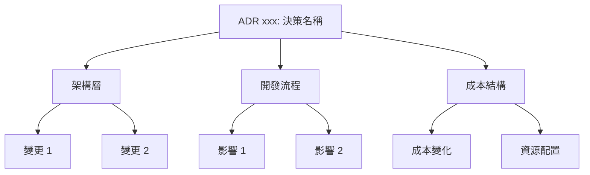
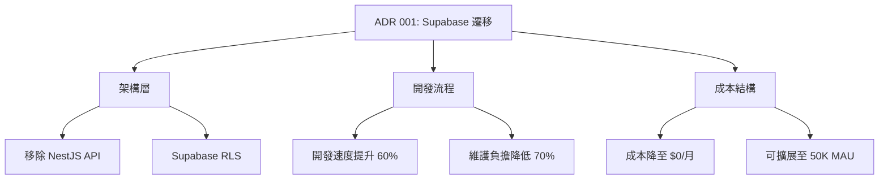

<!--
📖 使用此模板的步驟：
1. 複製此檔案並重新命名為 `{number:03d}-{slug}.md`（例：001-architecture-simplification.md）
2. 填寫 YAML frontmatter（🔴 紅色標記 = 必填，🟢 綠色標記 = 選填）
3. 根據實際需求刪除不需要的「選填」章節
4. 使用 `<!-- 範例： -->` 標記的內容僅供參考，請刪除

5. 完成後移除此使用指南

💡 提示：

- frontmatter 是單一真實來源，內文會自動引用
- 使用 <details> 折疊區塊來隱藏次要資訊
- 定期更新 `status` 和 `last_updated`
- 記錄狀態變更原因（特別是 deprecated/superseded 時）

📚 參考文檔：

- [Frontmatter Schema](./frontmatter-schema.md)
- [狀態 Emoji 指南](./status-emoji-guide.md)
- [檔案命名規範](./naming-conventions.md)
  -->

---

# ADR 元資料（YAML Frontmatter）

# 請根據 docs/templates/frontmatter-schema.md 填寫

# 🔴 基本資訊（必填）

title: 'ADR [編號]: [決策標題]' # 範例: "ADR 001: 架構簡化 - 從 NestJS 遷移至 Supabase"
type: 'adr' # 固定值: "adr"
adr_number: [編號] # 數字（3 位數），範例: 1

# 🔴 決策時間（必填）

date: 'YYYY-MM-DD' # ADR 撰寫日期，範例: "2025-11-07"
decision_date: '' # 實際決策日期（可能與撰寫日期不同），範例: "2025-11-07"
review_date: '' # 計劃審查日期，範例: "2026-11-07"

# 🔴 狀態追蹤（必填）

status: 'proposed' # draft | proposed | accepted | deprecated | superseded
status_reason: '' # 狀態變更原因（deprecated/superseded 時必填）

# 🟢 狀態歷史（選填，用於追蹤決策演進）

status_history: [] # 範例見下方註解

# 🔴 決策分類（必填）

decision_type: 'strategic' # strategic | technical | process | tooling

# 🟢 決策影響評估（選填但強烈建議）

impact_scope: '' # architecture | implementation | process | tooling
impact_level: '' # low | medium | high | critical
reversibility: '' # easy | medium | hard | irreversible

# 🟢 關聯資訊（選填）

supersedes: '' # 此 ADR 取代的舊 ADR，範例: "ADR 003"
superseded_by: '' # 取代此 ADR 的新 ADR，範例: "ADR 005"
related_adrs: [] # 相關 ADR 編號陣列，範例: [2, 3]
related_sprints: [] # 實施 Sprint 編號陣列，範例: [8, 9]
stakeholders: [] # 利益相關者列表，範例: ["Henry Lee", "Team Lead"]

# 🔴 元數據（必填）

tags: ['tag1', 'tag2'] # 相關標籤，範例: ["architecture", "backend", "cost-optimization"]
last_updated: 'YYYY-MM-DD' # 最後更新日期

# 狀態歷史範例：

# status_history:

# - date: '2025-11-07'

# status: 'proposed'

# reason: '初始提案'

# - date: '2025-11-10'

# status: 'accepted'

# reason: '團隊共識達成'

---

# ADR [編號]: [決策標題]

<!-- 概覽資訊區塊：自動引用 frontmatter 資料 -->

> **日期**: [date] | **狀態**: [status_emoji] [status] | **決策者**: [stakeholder]
>
> **決策類型**: [decision_type] | **影響程度**: [impact_level] | **可逆性**: [reversibility]

<!-- 取代通知（如適用）-->
<!-- 如果 status = 'superseded'，顯示：
> ⚠️ **此 ADR 已被取代**: 請參閱 [ADR {superseded_by}](./xxx-name.md)
-->

<!-- 範例：
> **日期**: 2025-11-07 | **狀態**: ✅ Accepted | **決策者**: Henry Lee
>
> **決策類型**: strategic | **影響程度**: critical | **可逆性**: hard
-->

---

## 📋 Context（背景）

[描述做出此決策時的背景情況，包含問題、限制、目標]

### 問題陳述

[清楚陳述需要解決的問題，使用 1-3 段文字]

<!-- 範例：
Flourish 專案當前使用 NestJS + PostgreSQL + Render 的架構，每月成本 $7+，且需要維護獨立的後端服務。隨著專案發展，維護負擔逐漸增加，而實際功能需求主要是 CRUD 操作和基礎統計查詢。
-->

### 當前狀況

**現有架構**:

- [描述 1]
- [描述 2]
- [描述 3]

<!-- 範例：
- 前端：Next.js 15（Flow + Apex）部署至 Vercel
- 後端：NestJS 11 API 部署至 Render
- 資料庫：PostgreSQL（Render）
- 成本：$7+/月（Render Hobby 方案）
-->

**主要限制條件**:

- [限制 1]: [說明]
- [限制 2]: [說明]
- [限制 3]: [說明]

<!-- 範例：
- 預算限制：希望降低運營成本
- 人力限制：獨立開發者，維護時間有限
- 功能範圍：當前主要是 CRUD 操作，不需要複雜後端邏輯
-->

---

## 🤔 Decision（決策）

我們決定：**[用一句話清楚陳述決策]**

<!-- 範例：
我們決定：**從 NestJS + Render 遷移至 Supabase，採用 Supabase-first 架構**
-->

### 選擇的方案

**方案**: [方案名稱或簡短描述]

[詳細描述選擇的方案及其實施方式，使用 2-4 段文字]

<!-- 範例：
**方案**: Supabase-first 架構

採用 Supabase 作為後端基礎設施，直接從前端（Flow/Apex）調用 Supabase REST API。Supabase 提供：
- PostgreSQL 資料庫
- 自動生成的 REST API
- Row Level Security (RLS) 權限控制
- 認證系統（Supabase Auth）
- Realtime 訂閱（未來需要時使用）
-->

**關鍵特點**:

1. [特點 1]
2. [特點 2]
3. [特點 3]

<!-- 範例：
1. 零成本：免費方案支援 500MB 資料庫 + 50K MAU
2. 快速開發：REST API 自動生成，無需手寫後端程式碼
3. 安全性：RLS 提供資料列級別權限控制
-->

---

## 🎯 Rationale（理由）

### 優勢

1. **[優勢 1]**
   - [詳細說明]
   - [量化數據或具體影響]

2. **[優勢 2]**
   - [詳細說明]
   - [量化數據或具體影響]

3. **[優勢 3]**
   - [詳細說明]

<!-- 範例：
1. **成本優化**
   - 從 $7+/月降至 $0/月（100% 成本削減）
   - 年度節省：$84+

2. **維護負擔降低**
   - 移除 NestJS API 維護（約 70% 維護時間）
   - 不需要管理 Render 部署

3. **開發速度提升**
   - REST API 自動生成，節省約 60% 後端開發時間
   - 內建認證系統，無需自建
-->

### 權衡考量

1. **[權衡點 1]**
   - **優點**: [說明]
   - **缺點**: [說明]
   - **決定**: [為何接受這個權衡]

2. **[權衡點 2]**
   - **優點**: [說明]
   - **缺點**: [說明]
   - **決定**: [為何接受這個權衡]

<!-- 範例：
1. **供應商鎖定 vs 開發效率**
   - **優點**: Supabase 提供完整基礎設施，極大提升開發效率
   - **缺點**: 綁定 Supabase 生態系統，未來遷移成本較高
   - **決定**: 當前階段優先考慮開發速度與成本，且 Supabase 基於 PostgreSQL，資料遷移相對容易

2. **功能限制 vs 簡化架構**
   - **優點**: 簡化架構，降低複雜度
   - **缺點**: 複雜業務邏輯需透過 Edge Functions 實作
   - **決定**: 當前功能需求簡單（CRUD + 統計），未來需要時再引入 Edge Functions
-->

---

## 🔄 Alternatives Considered（考慮過的替代方案）

### 快速比較

| 方案     | 核心優勢 | 關鍵劣勢 | 為何未選擇 |
| -------- | -------- | -------- | ---------- |
| [方案 A] | [優勢]   | [劣勢]   | [原因]     |
| [方案 B] | [優勢]   | [劣勢]   | [原因]     |
| [方案 C] | [優勢]   | [劣勢]   | [原因]     |

<!-- 範例：
| 方案 | 核心優勢 | 關鍵劣勢 | 為何未選擇 |
|------|----------|----------|------------|
| NestJS + PostgreSQL | 完全控制、類型安全 | 高成本 ($7/月)、維護負擔重 | 成本與維護不符合當前資源 |
| Firebase | 快速開發、無伺服器 | 供應商鎖定、成本不透明 | 長期成本風險高，且 NoSQL 不符需求 |
| Hasura | GraphQL 原生、實時訂閱 | 學習曲線陡峭 | 團隊無 GraphQL 經驗，遷移成本高 |
-->

<details>
<summary>📖 詳細分析（點擊展開）</summary>

### 方案 A: [方案名稱]

**完整描述**: [詳細說明此方案的技術實作與架構]

**技術評估**:

- ✅ **優點**:
  - [優點 1]
  - [優點 2]
  - [優點 3]

- ❌ **缺點**:
  - [缺點 1]
  - [缺點 2]
  - [缺點 3]

**決策邏輯**: [為何未選擇的深入分析]

---

### 方案 B: [方案名稱]

[重複方案 A 的結構]

---

### 方案 C: [方案名稱]

[重複方案 A 的結構]

</details>

---

## 📊 Comparison（方案比較）

> **評分標準**：1-5 分（1=差，5=優）
> **權重說明**：🔴 高權重（關鍵因素）| 🟡 中權重（重要因素）| 🟢 低權重（次要因素）

| 評估標準     | 權重 | [選擇方案] | [方案 A] | [方案 B] | 說明       |
| ------------ | ---- | ---------- | -------- | -------- | ---------- |
| **[標準 1]** | 🔴   | [評分]     | [評分]   | [評分]   | [簡短說明] |
| **[標準 2]** | 🔴   | [評分]     | [評分]   | [評分]   | [簡短說明] |
| **[標準 3]** | 🟡   | [評分]     | [評分]   | [評分]   | [簡短說明] |
| **[標準 4]** | 🟢   | [評分]     | [評分]   | [評分]   | [簡短說明] |

**加權總分**：[選擇方案] X.X | [方案 A] X.X | [方案 B] X.X

<!-- 範例：
| 評估標準 | 權重 | Supabase | NestJS | Firebase | 說明 |
|----------|------|----------|--------|----------|------|
| **成本** | 🔴 | 5 ($0/月) | 2 ($7/月) | 4 (限額內免費) | 長期成本考量關鍵 |
| **開發速度** | 🔴 | 5 (自動 API) | 3 (手寫 API) | 4 (快速) | 上市時間壓力 |
| **維護性** | 🟡 | 4 (低維護) | 3 (需維護) | 4 (低維護) | 團隊規模小 |
| **擴展性** | 🟢 | 4 (足夠) | 5 (完全控制) | 5 (無限) | 當前非瓶頸 |
| **學習曲線** | 🟡 | 4 (簡單) | 3 (中等) | 4 (簡單) | 快速上手重要 |

**加權總分**：Supabase 4.6 | NestJS 2.8 | Firebase 4.1
-->

---

## 📈 Consequences（影響）

### 影響範圍可視化（選填）



<!-- 範例：

-->

### 正面影響

- 🎯 **[影響 1]**: [描述]
  - **量化指標**: [具體數據]
  - **達成時間**: [時間範圍]

- 🎯 **[影響 2]**: [描述]
  - **量化指標**: [具體數據]
  - **達成時間**: [時間範圍]

<!-- 範例：
- 🎯 **成本優化**: 從 $7+/月降至 $0/月（100% 削減）
  - **量化指標**: 年度節省 $84+
  - **達成時間**: 立即生效

- 🎯 **開發效率提升**: 後端開發時間減少約 60%
  - **量化指標**: 原需 10 小時的 API 開發現需 4 小時
  - **達成時間**: Sprint 9 完成後
-->

### 負面影響與緩解措施

- ⚠️ **[影響 1]**: [描述負面影響]
  - **風險等級**: [高/中/低]
  - **緩解措施**: [如何減輕此影響]
  - **監控指標**: [如何追蹤此風險]

- ⚠️ **[影響 2]**: [描述負面影響]
  - **風險等級**: [高/中/低]
  - **緩解措施**: [如何減輕此影響]

<!-- 範例：
- ⚠️ **供應商鎖定風險**: 依賴 Supabase 生態系統
  - **風險等級**: 中
  - **緩解措施**:
    - 使用 Supabase CLI 管理遷移，保持 SQL 可攜性
    - 定期備份資料庫
    - 封存 NestJS 程式碼供未來參考
  - **監控指標**: Supabase 服務穩定性、價格變動

- ⚠️ **複雜邏輯限制**: REST API 難以處理複雜業務邏輯
  - **風險等級**: 低
  - **緩解措施**: 當需要時引入 Supabase Edge Functions
-->

### 風險評估

| 風險 | 可能性 | 影響程度 | 風險等級 | 緩解策略 |
|------|--------|----------|----------|----------|
| [風險 1] | 高/中/低 | 高/中/低 | 🔴/🟡/🟢 | [策略] |
| [風險 2] | 高/中/低 | 高/中/低 | 🔴/🟡/🟢 | [策略] |

<!-- 範例：
| 風險 | 可能性 | 影響程度 | 風險等級 | 緩解策略 |
|------|--------|----------|----------|----------|
| Supabase 服務中斷 | 低 | 高 | 🟡 中 | 定期備份、監控服務狀態 |
| 超出免費額度 | 中 | 中 | 🟡 中 | 監控使用量、設定預警 |
| 資料遷移困難 | 低 | 中 | 🟢 低 | PostgreSQL 相容性高 |
-->

---

## 🚀 Implementation（實施）

### 實施計劃

1. **Phase 1**: [階段名稱]（[時間範圍]）
   - [步驟 1]
   - [步驟 2]
   - [步驟 3]

2. **Phase 2**: [階段名稱]（[時間範圍]）
   - [步驟 1]
   - [步驟 2]

3. **Phase 3**: [階段名稱]（[時間範圍]）
   - [步驟 1]
   - [步驟 2]

<!-- 範例：
1. **Phase 1**: Supabase 環境設定（Sprint 9 Week 1）
   - 創建 Supabase 專案
   - 遷移 Prisma schema 至 Supabase SQL
   - 設定 RLS 政策

2. **Phase 2**: 前端整合（Sprint 9 Week 2）
   - 安裝 Supabase client
   - 更新前端 API 調用
   - 測試功能完整性

3. **Phase 3**: 舊系統移除（Sprint 9 Week 3）
   - 封存 NestJS API 程式碼
   - 關閉 Render 服務
   - 更新部署文檔
-->

### 成功標準

- [ ] [標準 1]
- [ ] [標準 2]
- [ ] [標準 3]
- [ ] [標準 4]

<!-- 範例：
- [x] Supabase 專案建立並連線成功
- [x] 所有既有 API 功能遷移完成
- [x] RLS 政策正確設定且測試通過
- [x] 前端應用程式正常運作
- [x] NestJS API 已封存
-->

### 回滾計劃

[如果此決策需要回滾，應該如何操作]

<!-- 範例：
如需回滾至 NestJS：
1. 從封存恢復 NestJS 程式碼（`docs/archive/nestjs-api/`）
2. 重新部署至 Render
3. 更新前端 API endpoint 配置
4. 預估回滾時間：4-6 小時

**注意**: 回滾後會失去 Supabase 期間建立的新資料，需手動遷移。
-->

---

## 📚 References（參考資料）

### 內部文檔

- 🏃 [Sprint [X]: 實施 Sprint](../sprints/sprint-XX-name.md)
- 🏛️ [ADR [X]: 相關決策](./XXX-name.md)
- 📖 [相關指南](../guides/category/name.md)

### 外部資源

- [標題 1](URL) - 簡短說明
- [標題 2](URL) - 簡短說明
- [標題 3](URL) - 簡短說明

<!-- 範例：
### 內部文檔
- 🏃 [Sprint 8: 架構評估](../sprints/sprint-08-deployment-evaluation.md)
- 🏃 [Sprint 9: Supabase 遷移](../sprints/sprint-09-supabase-migration-plan.md)

### 外部資源
- [Supabase 官方文檔](https://supabase.com/docs) - Supabase 完整文檔
- [Supabase vs Firebase](https://supabase.com/alternatives/supabase-vs-firebase) - 官方比較
- [NestJS 文檔](https://docs.nestjs.com/) - NestJS 官方文檔
-->

---

## 📝 Notes（備註）

[任何額外的備註或後續追蹤項目]

### 監控指標

[列出需要監控的關鍵指標，以驗證此決策的有效性]

| 指標 | 當前值 | 目標值 | 達成日期 | 狀態 |
|------|--------|--------|----------|------|
| [指標 1] | [值] | [值] | [日期] | [狀態] |
| [指標 2] | [值] | [值] | [日期] | [狀態] |

<!-- 範例：
| 指標 | 當前值 | 目標值 | 達成日期 | 狀態 |
|------|--------|--------|----------|------|
| 月度成本 | $7+ | $0 | 2025-11-20 | ✅ 達成 |
| 開發速度 | 基準 | +60% | 2025-12-01 | 🔄 追蹤中 |
| API 回應時間 | 基準 | <200ms | 2025-12-01 | 🔄 追蹤中 |
-->

### 審查計劃

**下次審查日期**: YYYY-MM-DD

**審查觸發條件**（滿足任一條件即需重新評估此決策）:

- [條件 1]
- [條件 2]
- [條件 3]

<!-- 範例：
**下次審查日期**: 2026-11-07

**審查觸發條件**:
- Supabase 免費額度調整或價格變動
- 用戶數超過 40K MAU（接近免費額度上限）
- 需要實作複雜業務邏輯且無法用 RLS 處理
- 出現更優的替代方案
-->

---

## 🔄 Updates（更新記錄）

### [YYYY-MM-DD] - [更新類型]

[描述更新內容]

<!-- 範例：
### 2025-11-20 - 實施完成

- Supabase 遷移已完成（Sprint 9）
- NestJS API 已封存至 `docs/archive/nestjs-api/`
- 成本從 $7/月降至 $0/月，達成預期目標

### 2025-12-01 - 監控更新

- API 回應時間平均 150ms（優於目標 200ms）
- 用戶數 5K MAU（遠低於 50K 免費額度）
- 未發現重大問題
-->

---

**最後更新**: YYYY-MM-DD
**相關 Sprint**: [Sprint [X]: 名稱](../sprints/sprint-XX-name.md)
**相關 ADR**: [ADR [X]: 名稱](./XXX-name.md)
```
