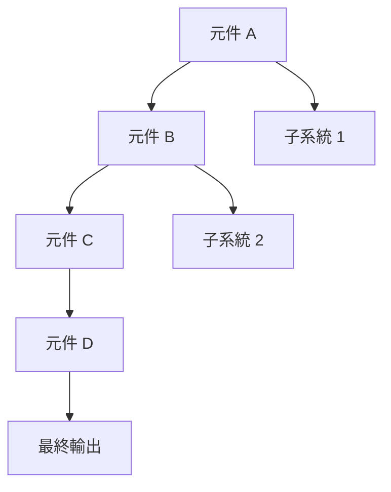
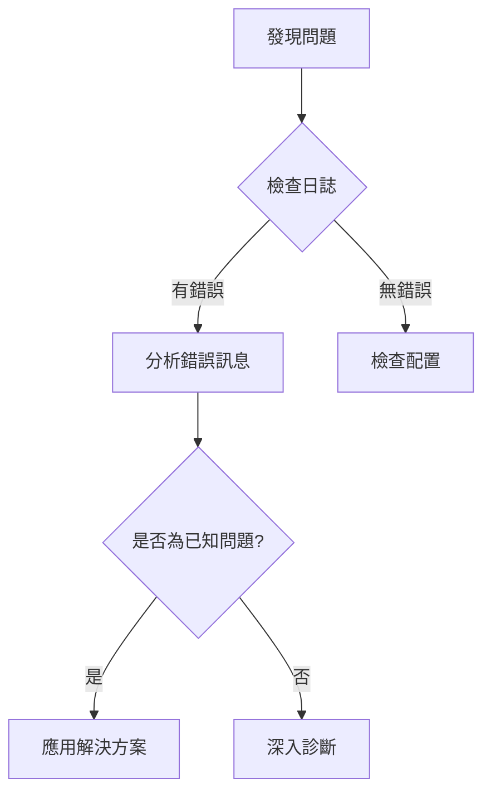
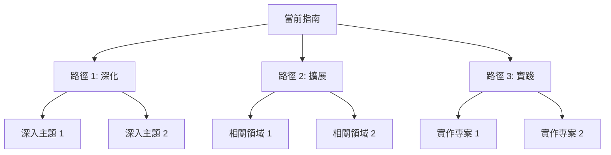

<!--
📖 Guide Template - Comprehensive（完整版）

**適用場景**:
- 深度技術指南（30+ 分鐘）
- 需要詳細架構說明的指南
- 包含複雜配置與最佳實踐
- 完整的端到端教學
- 需要更新記錄和回饋機制的指南

**不適用場景**:
- 簡單快速開始 → 使用 Basic 版
- 一般技術指南 → 使用 Standard 版
- 15 分鐘內完成的任務 → 使用 Basic 或 Standard 版

📚 其他模板：
- [Basic 版](./guide-template-basic.md) - 快速開始指南
- [Standard 版](./guide-template-standard.md) - 標準技術指南
-->

---

# 指南元資料（YAML Frontmatter）

# 🔴 基本資訊（必填）

title: '[指南標題]' # 範例: "Supabase 架構與進階優化完整指南"
type: 'guide' # 固定值: "guide"

# 🔴 分類（必填）

category: 'best-practices' # setup | development | deployment | testing | migration | best-practices
difficulty: 'advanced' # beginner | intermediate | advanced
estimated_time: '30-60 分鐘' # 範例: "30-60 分鐘"

# 🟢 前置條件（選填）

prerequisites: [] # 範例: ["完成 Supabase 設定", "了解 PostgreSQL", "熟悉 RLS 概念", "生產環境經驗"]

# 🟢 模板層級

template_level: 'comprehensive' # comprehensive（完整版）

# 🟢 相關文檔（選填）

related_guides: [] # 相關指南列表
related_adrs: [] # 相關 ADR 列表
related_sprints: [] # 相關 Sprint 列表

# 🟢 版本資訊（選填）

version: '1.0.0' # 文檔版本
target_versions: [] # 目標技術版本，範例: ["Supabase 2.0+", "PostgreSQL 15+"]

# 🔴 元數據（必填）

status: 'published' # draft | review | published | outdated
tags: ['tag1', 'tag2', 'tag3', 'tag4'] # 範例: ["supabase", "architecture", "performance", "security", "best-practices"]
last_updated: 'YYYY-MM-DD' # 最後更新日期

# 🟢 維護資訊（選填）

author: '' # 作者
reviewers: [] # 審查者列表

---

# [指南標題]

> **目的**: [用一到兩句話概括此指南的目的、涵蓋範圍和預期成果]
> **難度**: 🔴 進階 | **時間**: 30-60 分鐘 | **前置知識**: [詳細列出所需背景知識]
> **版本**: [version] | **最後更新**: [last_updated]

<!-- 範例：
> **目的**: 深入理解 Supabase 架構設計，掌握效能優化、安全強化與生產環境最佳實踐，打造高效能、高可用的應用程式
> **難度**: 🔴 進階 | **時間**: 45-60 分鐘 | **前置知識**: PostgreSQL 基礎、RLS 概念、資料庫索引、生產環境經驗
> **版本**: 1.0.0 | **最後更新**: 2025-11-25
-->

---

## 📑 內容目錄

- [Overview](#overview概覽)
- [Prerequisites](#prerequisites前置條件)
- [Architecture](#architecture架構說明)
- [Getting Started](#getting-started開始使用)
- [Detailed Guide](#detailed-guide詳細指南)
- [Configuration](#configuration配置說明)
- [Best Practices](#best-practices最佳實踐)
- [Advanced Topics](#advanced-topics進階主題)
- [Performance Optimization](#performance-optimization效能優化)
- [Security](#security安全性)
- [Examples](#examples完整範例)
- [Troubleshooting](#troubleshooting問題排查)
- [Next Steps](#next-steps下一步)
- [Related Documentation](#related-documentation相關文檔)
- [Updates & Changelog](#updates--changelog更新記錄)
- [Feedback](#feedback回饋)

---

## 📋 Overview（概覽）

### 指南範圍

[詳細描述此指南涵蓋的完整範圍、深度和廣度]

本指南將帶你深入了解：

1. **[主題 1]**: [詳細說明]
2. **[主題 2]**: [詳細說明]
3. **[主題 3]**: [詳細說明]
4. **[主題 4]**: [詳細說明]
5. **[主題 5]**: [詳細說明]

<!-- 範例：
1. **架構設計**: Supabase 各元件的角色與互動關係
2. **效能調校**: 資料庫索引、查詢優化、連線池管理
3. **安全強化**: RLS 進階模式、審計日誌、威脅防護
4. **高可用性**: 備份策略、災難復原、監控告警
5. **生產實踐**: CI/CD 整合、環境管理、團隊協作
-->

---

### 學習成果

完成本指南後，你將能夠：

- **[技能 1]**: [具體描述掌握的技能和應用場景]
- **[技能 2]**: [具體描述掌握的技能和應用場景]
- **[技能 3]**: [具體描述掌握的技能和應用場景]
- **[技能 4]**: [具體描述掌握的技能和應用場景]
- **[技能 5]**: [具體描述掌握的技能和應用場景]

<!-- 範例：
- **架構設計**: 設計可擴展的 Supabase 架構，支援 100K+ 日活用戶
- **效能調校**: 識別瓶頸並優化查詢，實現 <100ms 回應時間
- **安全實施**: 建立完整的 RLS 策略和審計機制，符合 GDPR 要求
- **營運管理**: 建立監控、告警和自動化備份系統
- **團隊協作**: 建立有效的開發流程和環境管理策略
-->

---

### 適用場景

本指南特別適合：

- ✅ [適用場景 1 - 詳細描述]
- ✅ [適用場景 2 - 詳細描述]
- ✅ [適用場景 3 - 詳細描述]

本指南可能不適合：

- ⚠️ [不適用場景 1 - 提供替代建議]
- ⚠️ [不適用場景 2 - 提供替代建議]

<!-- 範例：
本指南特別適合：
- ✅ 準備將 Supabase 應用部署到生產環境的團隊
- ✅ 需要優化現有 Supabase 應用效能的開發者
- ✅ 負責架構設計和安全審查的技術決策者

本指南可能不適合：
- ⚠️ Supabase 初學者 → 建議先閱讀 [Supabase 快速開始](./supabase-quickstart.md)
- ⚠️ 尋找特定 API 用法 → 參考 [官方 API 文檔](https://supabase.com/docs)
-->

---

## ✅ Prerequisites（前置條件）

### 必要工具與版本

| 工具     | 最低版本 | 推薦版本 | 檢查命令    | 安裝連結 |
| -------- | -------- | -------- | ----------- | -------- |
| [工具 1] | [版本]   | [版本]   | `[command]` | [連結]   |
| [工具 2] | [版本]   | [版本]   | `[command]` | [連結]   |
| [工具 3] | [版本]   | [版本]   | `[command]` | [連結]   |
| [工具 4] | [版本]   | [版本]   | `[command]` | [連結]   |

<!-- 範例：
| 工具 | 最低版本 | 推薦版本 | 檢查命令 | 安裝連結 |
|------|----------|----------|----------|----------|
| Supabase CLI | 1.0.0 | 1.50+ | `supabase --version` | [安裝](https://supabase.com/docs/guides/cli) |
| PostgreSQL | 14.0 | 15.0+ | `psql --version` | [安裝](https://www.postgresql.org/download/) |
| Node.js | 18.0 | 20.0+ | `node -v` | [安裝](https://nodejs.org/) |
| Docker | 20.0 | 24.0+ | `docker --version` | [安裝](https://docs.docker.com/get-docker/) |
-->

---

### 必要知識與技能

#### 核心知識（必須）

- [x] **[知識領域 1]**: [詳細說明需要什麼程度的理解]
- [x] **[知識領域 2]**: [詳細說明需要什麼程度的理解]
- [x] **[知識領域 3]**: [詳細說明需要什麼程度的理解]

<!-- 範例：
- [x] **PostgreSQL 資料庫**: 理解資料表、索引、查詢計劃、EXPLAIN 分析
- [x] **SQL 進階語法**: 熟悉 JOIN、子查詢、CTE、視圖、觸發器、函數
- [x] **資料庫安全**: 了解 RLS、角色權限、SQL 注入防護
-->

#### 建議知識（強烈推薦）

- [ ] **[知識領域 4]**: [說明此知識如何幫助學習]
- [ ] **[知識領域 5]**: [說明此知識如何幫助學習]

---

### 前置設定

在開始之前，請確保：

1. **[設定項目 1]**: [詳細說明和驗證方法]
2. **[設定項目 2]**: [詳細說明和驗證方法]
3. **[設定項目 3]**: [詳細說明和驗證方法]

```bash
# 快速驗證環境
node -v && pnpm -v && docker --version && supabase --version

# 預期輸出範例
# v20.x.x
# 9.x.x
# Docker version 24.x.x
# 1.x.x
```

---

## 🏛️ Architecture（架構說明）

### 系統架構總覽

[詳細說明系統的整體架構和元件關係]



<!-- 範例：
```mermaid
graph TB
    Client[Client Application] --> Kong[Kong API Gateway]

    Kong --> PostgREST[PostgREST]
    Kong --> GoTrue[GoTrue Auth]
    Kong --> Realtime[Realtime Server]
    Kong --> Storage[Storage API]

    PostgREST --> Postgres[(PostgreSQL)]
    GoTrue --> Postgres
    Realtime --> Postgres
    Storage --> ObjectStorage[S3-compatible Storage]

    Postgres --> Replicas[(Read Replicas)]

````
-->

---

### 核心元件說明

<details>
<summary>📦 元件 1: [元件名稱]（點擊展開）</summary>

**用途**: [說明此元件的核心功能]

**技術實現**: [說明使用的技術和實現方式]

**關鍵特性**:

- [特性 1]: [說明]
- [特性 2]: [說明]
- [特性 3]: [說明]

**與其他元件的互動**:

```mermaid
sequenceDiagram
    participant A as 元件 A
    participant B as 元件 B
    participant C as 元件 C

    A->>B: 請求
    B->>C: 處理
    C-->>A: 回應
````

</details>

<details>
<summary>📦 元件 2: [元件名稱]（點擊展開）</summary>

[重複元件 1 的結構]

</details>

---

### 資料流程圖

```mermaid
flowchart LR
    A[開始] --> B{條件判斷}
    B -->|是| C[處理 A]
    B -->|否| D[處理 B]
    C --> E[結束]
    D --> E
```

---

## 🚀 Getting Started（開始使用）

### 快速啟動（10 分鐘體驗）

[提供最簡化的快速開始步驟，讓讀者快速建立信心]

```bash
# 1️⃣ 步驟 1（預計 3 分鐘）
command-here

# 2️⃣ 步驟 2（預計 3 分鐘）
command-here

# 3️⃣ 步驟 3（預計 2 分鐘）
command-here

# 4️⃣ 驗證（預計 2 分鐘）
verification-command
```

**預期結果**: [描述成功執行後應該看到什麼]

**遇到問題？**: [快速問題排查提示]

---

## 📖 Detailed Guide（詳細指南）

### Phase 1: [階段名稱]（預計 X 分鐘）

[說明此階段的目標和重要性]

#### Step 1.1: [步驟名稱]

**目標**: [此步驟要達成什麼]

**操作步驟**:

1. **[子步驟 1]**: [詳細說明]

   ```bash
   # 命令
   command-here

   # 預期輸出
   expected-output
   ```

2. **[子步驟 2]**: [詳細說明]

3. **[子步驟 3]**: [詳細說明]

**配置範例**:

```[語言]
// 完整配置範例
// 包含詳細註解說明每個選項
{
  "option1": "value1",  // 用途說明
  "option2": {          // 複雜選項的詳細說明
    "nested": "value"
  }
}
```

**驗證**:

```bash
# 驗證命令
verify-command

# 預期輸出
✅ Success: [成功訊息]
```

**故障排除**:

- ❌ 如果看到 `[錯誤訊息]` → [快速修復]
- ⚠️ 如果遇到 `[警告訊息]` → [說明和處理方式]

---

#### Step 1.2: [步驟名稱]

[重複 Step 1.1 的結構]

---

### Phase 2: [階段名稱]（預計 X 分鐘）

[重複 Phase 1 的結構]

---

### Phase 3: [階段名稱]（預計 X 分鐘）

[重複 Phase 1 的結構]

---

## ⚙️ Configuration（配置說明）

### 配置檔案結構

```plaintext
project-root/
├── .env.local                    # 本地環境變數
├── .env.production               # 生產環境變數
├── [config-dir]/
│   ├── [config-file-1]           # 主配置檔案
│   ├── [config-file-2]           # 次要配置
│   └── [config-file-3]           # 進階配置
└── [other-dirs]/
```

---

### 環境變數完整參考

#### 必要環境變數

```bash
# ========================================
# [分類 1] - [詳細說明此分類的用途]
# ========================================
REQUIRED_VAR_1=value1              # [詳細說明用途、格式、範例]
REQUIRED_VAR_2=value2              # [詳細說明用途、格式、範例]

# ========================================
# [分類 2] - [詳細說明此分類的用途]
# ========================================
REQUIRED_VAR_3=value3              # [詳細說明用途、格式、範例]
```

<details>
<summary>📖 環境變數詳細說明表（點擊展開）</summary>

| 變數名稱 | 類型    | 必填 | 預設值    | 範例      | 用途說明   | 安全等級 |
| -------- | ------- | ---- | --------- | --------- | ---------- | -------- |
| `VAR_1`  | string  | ✅   | -         | `example` | [詳細說明] | 🔒 敏感  |
| `VAR_2`  | number  | ✅   | -         | `3000`    | [詳細說明] | 🔓 公開  |
| `VAR_3`  | boolean | 🟢   | `false`   | `true`    | [詳細說明] | 🔓 公開  |
| `VAR_4`  | string  | 🟢   | `default` | `custom`  | [詳細說明] | 🔒 敏感  |

**安全等級說明**:

- 🔒 **敏感**: 絕不能提交到版本控制或暴露給前端
- 🔓 **公開**: 可安全地包含在前端程式碼中

</details>

---

#### 選用環境變數

<details>
<summary>📋 選用環境變數列表（點擊展開）</summary>

```bash
# [分類] - [說明]
OPTIONAL_VAR_1=value1              # [用途、何時需要、影響]
OPTIONAL_VAR_2=value2              # [用途、何時需要、影響]
```

</details>

---

### 配置檔案範例

#### 開發環境配置

```[語言]
// config.development.[ext]
// 開發環境的完整配置範例
{
  "environment": "development",
  // 詳細註解每個配置選項
}
```

#### 生產環境配置

```[語言]
// config.production.[ext]
// 生產環境的完整配置範例
{
  "environment": "production",
  // 詳細註解每個配置選項
}
```

---

## 💎 Best Practices（最佳實踐）

### 架構設計最佳實踐

#### 1. [實踐主題 1]

**為什麼重要**: [深入解釋為何這是最佳實踐，包含背景和動機]

**實施方式**:

```[語言]
// ✅ 推薦做法（包含完整範例）
good-practice-example-with-context

// ❌ 常見錯誤做法
bad-practice-example

// 💡 更好的替代方案
better-alternative-example
```

**實際案例**: [提供真實世界的應用場景和效果]

**權衡考量**:

- **優點**: [列出優點]
- **缺點**: [列出缺點和限制]
- **適用場景**: [何時應該使用]
- **不適用場景**: [何時應該避免]

---

#### 2. [實踐主題 2]

[重複實踐主題 1 的結構]

---

### 開發最佳實踐

<details>
<summary>📋 開發流程最佳實踐清單（點擊展開）</summary>

1. **[實踐 1]**: [簡短說明]
   - **做法**: [具體實施方式]
   - **效益**: [帶來的好處]

2. **[實踐 2]**: [簡短說明]
   - **做法**: [具體實施方式]
   - **效益**: [帶來的好處]

3. **[實踐 3]**: [簡短說明]
   - **做法**: [具體實施方式]
   - **效益**: [帶來的好處]

</details>

---

### 安全最佳實踐

#### 安全檢查清單

- [ ] **[安全實踐 1]**: [詳細說明和實施方式]
- [ ] **[安全實踐 2]**: [詳細說明和實施方式]
- [ ] **[安全實踐 3]**: [詳細說明和實施方式]
- [ ] **[安全實踐 4]**: [詳細說明和實施方式]
- [ ] **[安全實踐 5]**: [詳細說明和實施方式]

#### 安全實施範例

```[語言]
// 完整的安全實施範例
// 包含認證、授權、輸入驗證等
```

---

### 效能最佳實踐

#### 效能優化策略

| 策略     | 優先級 | 預期改善 | 實施難度 | 適用場景 |
| -------- | ------ | -------- | -------- | -------- |
| [策略 1] | 🔴 高  | 50-80%   | 🟢 低    | [場景]   |
| [策略 2] | 🟠 中  | 20-40%   | 🟡 中    | [場景]   |
| [策略 3] | 🟡 低  | 10-20%   | 🔴 高    | [場景]   |

---

### 維護與營運最佳實踐

[說明長期維護和營運的最佳實踐]

---

## 🚀 Advanced Topics（進階主題）

### 主題 1: [進階主題名稱]

**概述**: [說明此進階主題的內容和應用場景]

**前置知識**: [需要理解哪些概念才能學習此主題]

#### 深入探討

[詳細說明進階概念和技術細節]

```[語言]
// 完整的進階用法範例
// 包含詳細註解和說明
```

#### 實際應用

**使用場景 1**: [詳細描述場景]

```[語言]
// 場景 1 的完整實現
```

**使用場景 2**: [詳細描述場景]

```[語言]
// 場景 2 的完整實現
```

#### 注意事項

- ⚠️ **[注意點 1]**: [詳細說明風險和緩解措施]
- ⚠️ **[注意點 2]**: [詳細說明風險和緩解措施]
- 💡 **[技巧 1]**: [實用技巧和經驗分享]

---

### 主題 2: [進階主題名稱]

[重複主題 1 的結構]

---

### 主題 3: [進階主題名稱]

[重複主題 1 的結構]

---

## ⚡ Performance Optimization（效能優化）

### 效能分析方法

#### 識別瓶頸

```bash
# 效能分析工具
profiling-command

# 查看指標
metrics-command
```

**關鍵指標**:

| 指標     | 目標值 | 警戒值 | 說明   | 優化建議 |
| -------- | ------ | ------ | ------ | -------- |
| [指標 1] | < X    | > Y    | [說明] | [建議]   |
| [指標 2] | < X    | > Y    | [說明] | [建議]   |
| [指標 3] | < X    | > Y    | [說明] | [建議]   |

---

### 優化策略

#### 策略 1: [優化策略名稱]

**問題描述**: [說明要解決的效能問題]

**診斷方法**:

```bash
# 診斷命令
diagnostic-command
```

**優化前**:

```[語言]
// 優化前的程式碼
// 顯示效能問題
```

**優化後**:

```[語言]
// 優化後的程式碼
// 展示改進方式
```

**效能提升**:

- **回應時間**: 從 Xms → Yms（改善 Z%）
- **資源使用**: 從 X → Y（減少 Z%）
- **吞吐量**: 從 X req/s → Y req/s（提升 Z%）

**權衡**:

- ✅ **優點**: [列出優點]
- ⚠️ **缺點**: [列出限制]
- 💡 **建議**: [使用建議]

---

#### 策略 2: [優化策略名稱]

[重複策略 1 的結構]

---

### 效能監控

```[語言]
// 效能監控實施範例
// 包含日誌、指標收集、告警設定
```

---

## 🔒 Security（安全性）

### 安全威脅模型

#### 威脅分析

| 威脅類型 | 風險等級 | 可能性 | 影響 | 緩解策略 |
| -------- | -------- | ------ | ---- | -------- |
| [威脅 1] | 🔴 高    | 高     | 嚴重 | [策略]   |
| [威脅 2] | 🟠 中    | 中     | 中等 | [策略]   |
| [威脅 3] | 🟡 低    | 低     | 輕微 | [策略]   |

---

### 安全實施指南

#### 認證與授權

```[語言]
// 完整的認證實施範例
// 包含多種認證方式
```

#### 資料保護

```[語言]
// 資料加密和保護範例
// 包含傳輸層和儲存層安全
```

#### 審計與監控

```[語言]
// 安全審計和監控實施
// 包含日誌記錄和異常偵測
```

---

### 安全檢查清單

完整的生產環境安全檢查：

<details>
<summary>📋 安全檢查清單（點擊展開）</summary>

#### 認證安全

- [ ] [檢查項 1]: [詳細說明和驗證方法]
- [ ] [檢查項 2]: [詳細說明和驗證方法]

#### 授權安全

- [ ] [檢查項 1]: [詳細說明和驗證方法]
- [ ] [檢查項 2]: [詳細說明和驗證方法]

#### 資料安全

- [ ] [檢查項 1]: [詳細說明和驗證方法]
- [ ] [檢查項 2]: [詳細說明和驗證方法]

#### 網路安全

- [ ] [檢查項 1]: [詳細說明和驗證方法]
- [ ] [檢查項 2]: [詳細說明和驗證方法]

#### 應用安全

- [ ] [檢查項 1]: [詳細說明和驗證方法]
- [ ] [檢查項 2]: [詳細說明和驗證方法]

</details>

---

## 📊 Examples（完整範例）

### 範例 1: [使用場景名稱]

**背景**: [詳細描述使用場景的背景和需求]

**目標**: [明確說明此範例要達成的目標]

**架構圖**:


**完整實現**:

```[語言]
// 完整的程式碼範例
// 包含詳細註解說明每個部分
// 可直接複製使用
```

**執行步驟**:

1. **[步驟 1]**: [說明]
2. **[步驟 2]**: [說明]
3. **[步驟 3]**: [說明]

**預期結果**:

```
# 輸出範例
成功的執行結果
```

**延伸應用**:

- [延伸 1]: [如何調整此範例以適應其他場景]
- [延伸 2]: [如何擴展功能]

---

### 範例 2: [使用場景名稱]

[重複範例 1 的結構]

---

### 範例 3: [使用場景名稱]

[重複範例 1 的結構]

---

## 🐛 Troubleshooting（問題排查）

### 診斷流程



---

### 常見問題快速索引

| 問題類型 | 症狀   | 可能原因 | 快速修復 | 詳細章節  |
| -------- | ------ | -------- | -------- | --------- |
| [類型 1] | [症狀] | [原因]   | [修復]   | [連結](#) |
| [類型 2] | [症狀] | [原因]   | [修復]   | [連結](#) |
| [類型 3] | [症狀] | [原因]   | [修復]   | [連結](#) |

---

### 詳細問題解決

<details>
<summary>🔍 問題 1: [問題描述]（點擊展開）</summary>

#### 症狀

[詳細描述問題的表現]

```bash
# 錯誤訊息範例
error-message-here
```

#### 根本原因

[深入分析問題的根本原因]

#### 診斷步驟

1. **檢查 [項目 1]**:

   ```bash
   # 診斷命令
   diagnostic-command
   ```

2. **驗證 [項目 2]**:

   ```bash
   # 驗證命令
   verification-command
   ```

3. **確認 [項目 3]**:

   ```bash
   # 確認命令
   confirmation-command
   ```

#### 解決方案

**方案 A（推薦）**: [說明]

```bash
# 解決步驟
solution-commands
```

**方案 B（替代）**: [說明]

```bash
# 替代解決步驟
alternative-solution
```

#### 驗證修復

```bash
# 驗證命令
verify-fix-command

# 預期輸出
✅ 問題已解決
```

#### 預防措施

- [措施 1]: [說明如何避免再次發生]
- [措施 2]: [說明如何避免再次發生]

</details>

<details>
<summary>🔍 問題 2: [問題描述]（點擊展開）</summary>

[重複問題 1 的結構]

</details>

<details>
<summary>🔍 問題 3: [問題描述]（點擊展開）</summary>

[重複問題 1 的結構]</details>

---

### 除錯技巧

#### 日誌分析

```bash
# 啟用詳細日誌
enable-verbose-logging

# 查看即時日誌
tail-logs-command

# 搜尋特定錯誤
grep-error-command
```

#### 效能分析

```bash
# 效能剖析
profiling-command

# 記憶體分析
memory-analysis-command
```

---

## 🎯 Next Steps（下一步）

### 學習路徑

完成此完整指南後，建議的進階學習路徑：



---

### 推薦順序

#### 🔴 高優先級（強烈建議）

1. **📖 [指南 1](./guide-1.md)**
   - **難度**: [emoji] [等級]
   - **時間**: [時間]
   - **目的**: [詳細說明]
   - **為什麼重要**: [解釋為何是下一步]
   - **前置條件**: [需要什麼背景]

2. **📖 [指南 2](./guide-2.md)**
   - [重複上述結構]

#### 🟠 中優先級（建議）

1. **📖 [指南 3](./guide-3.md)**
   - [重複上述結構]

#### 🟡 低優先級（選用）

1. **📖 [指南 4](./guide-4.md)**
   - [重複上述結構]

---

### 實踐專案建議

將所學應用到實際專案：

1. **[專案 1]**: [描述專案目標和範圍]
   - **難度**: [等級]
   - **時間**: [估計]
   - **技能運用**: [會用到哪些本指南教的技能]

2. **[專案 2]**: [描述專案目標和範圍]

---

## 📚 Related Documentation（相關文檔）

### 內部文檔

#### 指南系列

- 📖 [前置指南](./prerequisite-guide.md) - [簡短說明]
- 📖 [相關指南 1](./related-guide-1.md) - [簡短說明]
- 📖 [相關指南 2](./related-guide-2.md) - [簡短說明]
- 📖 [進階指南](./advanced-guide.md) - [簡短說明]

#### 架構決策

- 🏛️ [ADR XXX: 相關決策 1](../decisions/XXX-name.md) - [簡短說明]
- 🏛️ [ADR XXX: 相關決策 2](../decisions/XXX-name.md) - [簡短說明]

#### Sprint 文檔

- 🏃 [Sprint XX: 相關 Sprint 1](../sprints/release-X/XX-name.md) - [簡短說明]
- 🏃 [Sprint XX: 相關 Sprint 2](../sprints/release-X/XX-name.md) - [簡短說明]

---

### 外部資源

#### 官方文檔

- 🔗 [官方文檔首頁](https://external-link.com) - 完整文檔
- 🔗 [API 參考](https://external-link.com/api) - API 規格
- 🔗 [最佳實踐](https://external-link.com/best-practices) - 官方建議

#### 社群資源

- 🔗 [GitHub Repository](https://github.com/org/repo) - 原始碼和範例
- 🔗 [社群論壇](https://community.example.com) - 問題討論
- 🔗 [Stack Overflow 標籤](https://stackoverflow.com/questions/tagged/tag) - Q&A

#### 學習資源

- 🔗 [官方教學](https://external-link.com/tutorials) - 逐步教學
- 🔗 [影片課程](https://video-platform.com) - 視覺化學習
- 🔗 [部落格文章](https://blog.example.com) - 深度文章

---

## 🔄 Updates & Changelog（更新記錄）

### Version [X.Y.Z] - YYYY-MM-DD

**重大變更** 🔴:

- [變更 1]: [詳細說明變更內容和影響]
- [變更 2]: [詳細說明變更內容和影響]

**新增功能** ✨:

- [功能 1]: [說明新功能]
- [功能 2]: [說明新功能]

**改進** 💎:

- [改進 1]: [說明改進內容]
- [改進 2]: [說明改進內容]

**錯誤修正** 🐛:

- [修正 1]: [說明修正的問題]
- [修正 2]: [說明修正的問題]

**文檔** 📝:

- [文檔更新 1]: [說明]
- [文檔更新 2]: [說明]

**遷移指南** 🔀:

如果你正在使用 v[X.Y.Z-1]，升級到 v[X.Y.Z] 需要：

1. [遷移步驟 1]
2. [遷移步驟 2]
3. [遷移步驟 3]

---

### Version [X.Y.Z-1] - YYYY-MM-DD

[重複上述結構]

---

## 💬 Feedback（回饋）

### 回饋管道

我們重視你的回饋！如果你：

- 🐛 **發現錯誤**: [如何回報錯誤]
- 💡 **有改進建議**: [如何提出建議]
- ❓ **有疑問**: [如何提問]
- 📖 **想貢獻**: [如何貢獻文檔]

請透過以下方式聯繫：

- 📧 **GitHub Issue**: [提出 Issue](GitHub Issue 連結)
- 💬 **討論區**: [加入討論](連結)
- 🔀 **Pull Request**: 直接編輯此文檔並提交 PR
- 📧 **Email**: [email@example.com](mailto:email@example.com)

---

### 貢獻指南

想要改進此文檔？請遵循以下步驟：

1. **Fork** 此儲存庫
2. **創建分支**: `git checkout -b improve-guide-name`
3. **進行修改**: 遵循文檔模板和風格
4. **提交變更**: `git commit -m "docs: improve [section]"`
5. **推送分支**: `git push origin improve-guide-name`
6. **創建 PR**: 詳細說明改進內容

---

### 常見回饋

<details>
<summary>📋 常見問題與回應（點擊展開）</summary>

**Q: [常見問題 1]**

A: [詳細回答]

**Q: [常見問題 2]**

A: [詳細回答]

</details>

---

## 📋 Completion Checklist（完成檢查清單）

完成本指南後，確認以下所有項目：

### 🟢 基礎設定

- [ ] 所有前置工具已安裝並驗證版本
- [ ] 環境變數正確配置並測試
- [ ] 基礎功能正常運作
- [ ] 能夠成功執行所有 Getting Started 步驟

### 🟢 詳細指南

- [ ] 完成所有 Phase 的步驟
- [ ] 理解每個步驟的目的和原理
- [ ] 成功驗證每個步驟的結果
- [ ] 能夠獨立重現所有步驟

### 🟢 配置驗證

- [ ] 所有配置檔案已創建並驗證
- [ ] 環境變數設定正確無誤
- [ ] 配置符合安全最佳實踐
- [ ] 配置符合效能最佳實踐

### 🟡 最佳實踐

- [ ] 理解並能應用架構設計最佳實踐
- [ ] 理解並能應用開發最佳實踐
- [ ] 理解並能應用安全最佳實踐
- [ ] 理解並能應用效能最佳實踐

### 🟡 進階主題

- [ ] 理解所有進階主題的概念
- [ ] 嘗試過至少 2 個進階主題
- [ ] 知道何時應用進階技術
- [ ] 理解進階技術的權衡

### 🔴 效能與安全

- [ ] 理解效能優化策略
- [ ] 能夠識別效能瓶頸
- [ ] 理解安全威脅模型
- [ ] 完成安全檢查清單

### 🔴 實踐應用

- [ ] 完成至少 1 個完整範例
- [ ] 能夠將知識應用到實際專案
- [ ] 知道如何診斷和解決常見問題
- [ ] 建立了自己的參考筆記

---

**最後更新**: YYYY-MM-DD
**維護者**: [名稱]
**審查者**: [審查者列表]
**版本**: [version]
**難度評級**: 🔴 進階
**預估完成時間**: 30-60 分鐘
