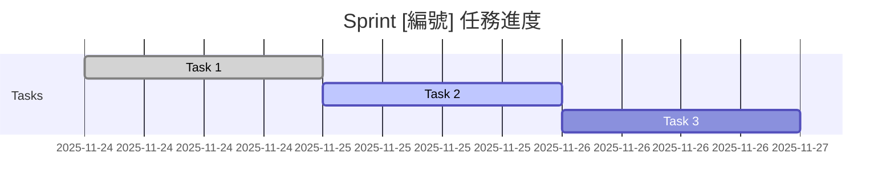

<!--
📖 使用此模板的步驟：
1. 複製此檔案並重新命名為 `sprint-{number:02d}-{slug}.md`
2. 填寫 YAML frontmatter（🔴 紅色標記 = 必填，🟢 綠色標記 = 選填）
3. 根據實際需求刪除不需要的「選填」章節
4. 使用 `<!-- 範例： -->` 標記的內容僅供參考，請刪除

5. 完成後移除此使用指南

💡 提示：

- frontmatter 是單一真實來源，內文會自動引用
- 使用 <details> 折疊區塊來隱藏次要資訊
- 定期更新 `last_updated` 和 `status`

📚 參考文檔：

- [Frontmatter Schema](./frontmatter-schema.md)
- [狀態 Emoji 指南](./status-emoji-guide.md)
- [檔案命名規範](./naming-conventions.md)
  -->

---

# Sprint 元資料（YAML Frontmatter）

# 請根據 docs/templates/frontmatter-schema.md 填寫

# 🔴 基本資訊（必填）

title: 'Sprint [編號]: [Sprint 名稱]' # 範例: "Sprint 14: 文檔標準化"
type: 'sprint' # 固定值: "sprint"
release: 'Release [X]' # 範例: "Release 1"
sprint_number: [編號] # 數字，範例: 14

# 🔴 時間追蹤（必填）

duration: '[X-Y] 小時' # 範例: "79-117 小時"
start_date: 'YYYY-MM-DD' # 範例: "2025-11-24"
completed_date: '' # 完成後填寫，範例: "2025-11-25"（未完成時留空）
status: 'planning' # planning | in_progress | completed | blocked

# 🔴 分類與優先級（必填）

priority: 'P[X]' # P0 | P1 | P2 | P3
tags: ['tag1', 'tag2'] # 範例: ["documentation", "standardization"]

# 🟢 Sprint 分類（選填）

category: '' # infrastructure | feature | documentation | refactor | bugfix

# 🟢 關聯資訊（選填）

related_sprints: [] # 相關 Sprint 編號陣列，範例: [12, 13]
related_adrs: [] # 相關 ADR 編號陣列，範例: [1]

# 🟢 團隊資訊（選填）

assignee: '' # 負責人
reviewers: [] # 審查者列表

# 🟢 GitHub 整合（選填）

github_issue: '' # GitHub Issue URL
github_milestone: '' # GitHub Milestone 名稱

# 🔴 元數據（必填）

## last_updated: 'YYYY-MM-DD' # 最後更新日期

# Sprint [編號]: [Sprint 名稱]

<!-- 概覽資訊區塊：自動引用 frontmatter 資料 -->

> **持續時間**: [duration] | **開始**: [start_date] | **狀態**: [status_emoji] [status]
> **優先級**: [priority_emoji] [priority] | **分類**: [category]
> **Issue**: [#XX](GitHub Issue 連結)

<!-- 範例：
> **持續時間**: 79-117 小時 | **開始**: 2025-11-24 | **狀態**: 🔄 進行中
> **優先級**: 🟠 P1 | **分類**: documentation
> **Issue**: [#35](https://github.com/u88803494/flourish/issues/35)
-->

---

## 🎯 Sprint 目標

[用 1-3 句話清楚描述此 Sprint 的主要目標和預期成果]

<!-- 範例：
完成文檔標準化，建立統一的 Sprint、ADR、Guide 模板，並整合 markdownlint 工具。最終目標是提升文檔一致性與可維護性。
-->

---

## 📋 背景

### 問題陳述

[清楚說明為什麼需要這個 Sprint，以及它解決什麼問題]

**當前痛點**:

- [痛點 1]: [具體描述]
- [痛點 2]: [具體描述]

<!-- 範例：
- 文檔格式不一致：各 Sprint 文檔結構差異大，難以快速定位資訊
- 缺少元數據：無法自動化處理或生成文檔索引
-->

### 解決方案

[概述如何解決上述問題]

- [方案要點 1]
- [方案要點 2]

<!-- 範例：
- 建立標準化模板，包含統一的 YAML frontmatter
- 整合 markdownlint 工具，自動化格式檢查
-->

---

## 📋 Tasks

### Task 1: [任務名稱] {#task-1}

> **時間**: [X-Y] 小時 | **PR**: [#XX](連結) 或 TBD | **狀態**: [status_emoji] [status]

<!-- 範例：
> **時間**: 20-30 小時 | **PR**: [#38](https://github.com/u88803494/flourish/pull/38) | **狀態**: ✅ 已完成
-->

#### 🎯 目標

[用一句話描述此任務的核心目標]

<!-- 範例：
建立 markdownlint 配置，整合至 pre-commit 流程，並修復所有既有 lint 錯誤。
-->

#### 📝 工作內容

- [ ] **子任務 1.1**: [簡短描述]
- [ ] **子任務 1.2**: [簡短描述]
- [ ] **子任務 1.3**: [簡短描述]

<!-- 範例：
- [x] **安裝 markdownlint-cli2**: 設定 package.json script
- [x] **創建配置檔**: .markdownlint.jsonc（中文友好規則）
- [x] **整合 lint-staged**: 自動化 pre-commit 檢查
- [x] **修復 lint 錯誤**: 從 7544 → 0 錯誤
-->

<details>
<summary>📋 驗收標準（點擊展開）</summary>

- [ ] [標準 1]: [具體可驗證的標準]
- [ ] [標準 2]: [具體可驗證的標準]
- [ ] [標準 3]: [具體可驗證的標準]

<!-- 範例：
- [x] markdownlint 配置檔已建立且遵循專案需求
- [x] 所有既有文檔通過 lint 檢查（0 錯誤）
- [x] pre-commit hook 正常運作
-->

</details>

<details>
<summary>💻 技術細節（選填，點擊展開）</summary>

```[語言]
// 關鍵代碼片段或配置範例
```

<!-- 範例：
```json
{
  "scripts": {
    "lint:md": "markdownlint-cli2",
    "lint:md:fix": "markdownlint-cli2 --fix"
  }
}
```
-->

</details>

---

### Task 2: [任務名稱] {#task-2}

> **時間**: [X-Y] 小時 | **PR**: TBD | **狀態**: 📦 規劃中

[重複 Task 1 的結構]

---

### Task 3: [任務名稱] {#task-3}

> **時間**: [X-Y] 小時 | **PR**: TBD | **狀態**: 📦 規劃中

[重複 Task 1 的結構]

---

## 🎯 成功標準

Sprint 完成的整體標準（涵蓋所有 Tasks）：

- [ ] 所有 Tasks 完成並合併至目標分支
- [ ] 相關測試通過（如適用）
- [ ] 文檔已更新（README、Guide 等）
- [ ] PR 已審查並批准
- [ ] 無已知的阻塞問題或技術債

---

## 📊 進度追蹤

### 任務完成度

**總覽**: [[completed]/[total]] 任務完成 ([percentage]%) | **實際/估計**: [actual]h / [estimated]h

<!-- 範例：
**總覽**: [3/5] 任務完成 (60%) | **實際/估計**: 45h / 79-117h
-->

### 時間線視覺化（選填）



<!-- 使用 Mermaid 創建 Gantt 圖，視覺化任務時間線 -->

<details>
<summary>📈 詳細時間統計（點擊展開）</summary>

| Task ID  | 任務名稱 | 估計時間   | 實際時間 | 差異    | 狀態 | 備註   |
| -------- | -------- | ---------- | -------- | ------- | ---- | ------ |
| Task 1   | [名稱]   | 4-6h       | 5h       | ✅ 正常 | ✅   | -      |
| Task 2   | [名稱]   | 6-8h       | 10h      | ⚠️ 超時 | 🔄   | [原因] |
| Task 3   | [名稱]   | 5-7h       | TBD      | -       | 📦   | -      |
| **總計** | -        | **15-21h** | **15h**  | -       | -    | -      |

</details>

### 里程碑

- [x] Sprint 開始
- [x] Task 1 完成
- [ ] Task 2 完成
- [ ] Task 3 完成
- [ ] Sprint 完成

---

## 📚 學到的經驗

### 成功經驗 ✅

1. **[標題]**: [描述成功的做法和原因]
   - **關鍵因素**: [是什麼讓它成功]
   - **可複製性**: [如何在未來複製此成功]

<!-- 範例：
1. **並行任務執行**: 三個 Task 可同時進行，加速 Sprint 完成
   - **關鍵因素**: 任務間依賴性低，明確分工
   - **可複製性**: 未來 Sprint 規劃時優先考慮任務獨立性
-->

### 遇到的挑戰 ⚠️

1. **[標題]**: [描述遇到的問題]
   - **根本原因**: [深層原因分析]
   - **解決方案**: [如何解決]
   - **預防措施**: [未來如何避免]

<!-- 範例：
1. **Lint 錯誤數量驚人**: 初次執行發現 7544 個錯誤
   - **根本原因**: 缺乏自動化格式檢查，累積大量技術債
   - **解決方案**: 逐步修正規則配置，自動化修復，手動處理特殊情況
   - **預防措施**: 建立 pre-commit hook，避免未來累積
-->

### 改進建議 💡

1. **[領域]**: [具體建議]
2. **[領域]**: [具體建議]

<!-- 範例：
1. **估時準確度**: 增加 20% buffer 時間，應對不可預見問題
2. **文檔同步**: 每完成一個 Task 立即更新相關文檔，避免遺忘
-->

---

## 🔗 相關文檔

### Sprint & Release

- 🏃 [Release [X] 總覽](../release-[X]-name/README.md)
- 🏃 [Sprint [X-1]: 前一個 Sprint](./sprint-[X-1]-name.md)
- 🏃 [Sprint [X+1]: 下一個 Sprint](./sprint-[X+1]-name.md)

### 架構決策

- 🏛️ [ADR [編號]: 相關決策](../decisions/[number]-name.md)

### 技術指南

- 📖 [相關指南 1](../guides/category/guide-name.md)
- 📖 [相關指南 2](../guides/category/guide-name.md)

### GitHub 資源

- #️⃣ **Issue**: [#XX - 標題](GitHub Issue URL)
- 🔀 **PR**: [#XX - 標題](GitHub PR URL)
- 🎯 **Milestone**: [Milestone 名稱](GitHub Milestone URL)

<!-- 範例：
### GitHub 資源
- #️⃣ **Issue**: [#35 - 文檔標準化](https://github.com/u88803494/flourish/issues/35)
- 🔀 **PR**: [#38 - Task 4 完成](https://github.com/u88803494/flourish/pull/38)
- 🎯 **Milestone**: Release 1
-->

---

## 📝 備註

[任何額外的備註、提醒或觀察]

### 技術債

- [ ] [技術債 1]: [描述] - 優先級: [P0-P3]
- [ ] [技術債 2]: [描述] - 優先級: [P0-P3]

### 後續工作

- [ ] Sprint [X+1]: [名稱] - [簡短描述]
- [ ] 需要追蹤的長期改進項目

### 阻塞問題（如有）

- 🔥 **[問題標題]**: [描述] - 負責人: [名稱] - 截止日: [日期]

<!-- 範例：
- 🔥 **Supabase API 限流**: 需升級至 Pro 方案 - 負責人: Henry - 截止日: 2025-12-01
-->

---

**最後更新**: YYYY-MM-DD
**當前狀態**: [status_emoji] [status] ([percentage]% 完成)
**當前 Task**: Task [X] - [名稱]
