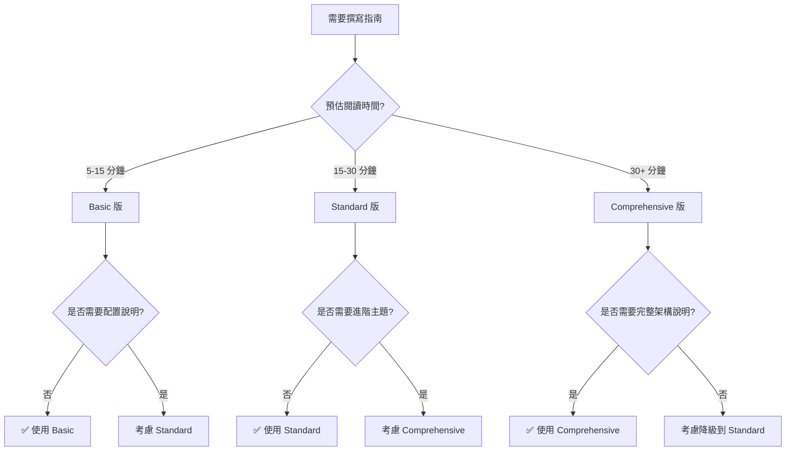

# 模板使用指南

本文檔是 Flourish 專案文檔模板系統的完整使用指南。

## 📋 目的

統一的模板系統確保：

- **一致性**：所有文檔遵循相同的結構和格式
- **易用性**：清楚的指引和範例讓文檔撰寫更簡單
- **可追蹤性**：YAML frontmatter 支援自動化處理和分析
- **專業性**：高品質的文檔展現專業團隊形象

---

## 🗂️ 模板總覽

Flourish 專案提供三類文檔模板：

| 模板類型                           | 用途              | 檔案位置                          | 適用場景             |
| ---------------------------------- | ----------------- | --------------------------------- | -------------------- |
| **Sprint Template**                | Sprint 規劃與追蹤 | `sprint-template.md`              | Sprint 開始時創建    |
| **ADR Template**                   | 架構決策記錄      | `adr-template.md`                 | 重大技術決策時創建   |
| **Guide Template - Basic**         | 快速開始指南      | `guide-template-basic.md`         | 5-15 分鐘的簡單指南  |
| **Guide Template - Standard**      | 標準技術指南      | `guide-template-standard.md`      | 15-30 分鐘的完整指南 |
| **Guide Template - Comprehensive** | 深度指南          | `guide-template-comprehensive.md` | 30+ 分鐘的深度指南   |

---

## 🎯 如何選擇正確的模板

### Sprint Template

**使用時機**：

- ✅ 規劃新的 Sprint
- ✅ 追蹤 Sprint 進度
- ✅ 記錄 Sprint 成果和經驗

**不要使用**：

- ❌ 記錄技術決策 → 使用 ADR Template
- ❌ 撰寫技術教學 → 使用 Guide Template

---

### ADR Template

**使用時機**：

- ✅ 做出重大技術決策（架構、技術選型、流程）
- ✅ 需要記錄決策背景和考量
- ✅ 需要追蹤決策演進和取代關係

**不要使用**：

- ❌ 記錄 Sprint 計劃 → 使用 Sprint Template
- ❌ 撰寫操作指南 → 使用 Guide Template

---

### Guide Template 選擇

使用決策樹：



#### Basic 版（guide-template-basic.md）

**適用場景**：

- ✅ 快速開始指南（5-15 分鐘）
- ✅ 簡單的設定與安裝
- ✅ 單一功能的使用說明
- ✅ 不需要複雜配置

**特色**：

- 簡化的結構（~200 行）
- 表格式的快速檢查
- Step-by-step 命令列表
- 快速診斷表

**範例**：

- "Supabase 快速開始"
- "安裝開發環境"
- "第一個 API 呼叫"

---

#### Standard 版（guide-template-standard.md）

**適用場景**：

- ✅ 完整的技術指南（15-30 分鐘）
- ✅ 需要配置說明
- ✅ 多步驟的開發流程
- ✅ 需要最佳實踐指導

**特色**：

- 完整的結構（~250 行）
- 詳細的配置章節
- Best Practices 章節
- 進階用法章節

**範例**：

- "Supabase 本地開發設定"
- "資料庫遷移工作流程"
- "RLS 政策設計"

---

#### Comprehensive 版（guide-template-comprehensive.md）

**適用場景**：

- ✅ 深度技術指南（30+ 分鐘）
- ✅ 需要詳細架構說明
- ✅ 包含複雜配置與最佳實踐
- ✅ 完整的端到端教學

**特色**：

- 最完整的結構（~350 行）
- Architecture 章節
- Performance Optimization 章節
- Security 章節
- Updates & Changelog 章節

**範例**：

- "Supabase 架構與進階優化"
- "生產環境部署完整指南"
- "安全強化與審計機制"

---

## 📝 使用流程

### 1. 複製模板

```bash
# 移動到正確的目錄
cd docs/

# Sprint 文檔
cp templates/sprint-template.md sprints/release-X/YY-sprint-name.md

# ADR 文檔
cp templates/adr-template.md decisions/XXX-decision-name.md

# Guide 文檔（選擇適合的版本）
cp templates/guide-template-basic.md guides/category/guide-name.md
cp templates/guide-template-standard.md guides/category/guide-name.md
cp templates/guide-template-comprehensive.md guides/category/guide-name.md
```

---

### 2. 填寫 Frontmatter

**關鍵原則**：

- 🔴 **紅色標記（必填）**：這些欄位必須填寫
- 🟢 **綠色標記（選填）**：根據需要填寫，不需要可刪除
- **單一真實來源**：Frontmatter 是資料的唯一來源，內文引用它

#### Frontmatter 填寫步驟

1. **填寫基本資訊**（🔴 必填）

   ```yaml
   title: '[具體標題]' # 清楚描述文檔內容
   type: '[type]' # sprint | adr | guide（固定值）
   ```

2. **填寫分類資訊**（🔴 必填）

   ```yaml
   # Sprint
   release: 'Release [X]'
   sprint_number: [編號]
   priority: 'P[0-3]'
   status: 'planning'         # planning | in_progress | completed | blocked

   # ADR
   status: 'proposed'         # draft | proposed | accepted | superseded | deprecated
   decision_date: 'YYYY-MM-DD'

   # Guide
   category: '[category]'     # setup | development | deployment | testing | migration | best-practices
   difficulty: '[level]'      # beginner | intermediate | advanced
   ```

3. **填寫選填資訊**（🟢 選填）

   根據需要填寫追蹤和關聯資訊：

   ```yaml
   # 關聯資訊
   related_sprints: [12, 13]
   related_adrs: [1]
   related_guides: ['supabase-setup']

   # GitHub 整合
   github_issue: 'https://github.com/org/repo/issues/XX'
   github_milestone: 'Release 1'

   # 團隊資訊
   assignee: 'Henry'
   reviewers: ['Reviewer1', 'Reviewer2']
   ```

4. **填寫 tags 和更新日期**（🔴 必填）

   ```yaml
   tags: ['tag1', 'tag2', 'tag3']
   last_updated: '2025-11-25'
   ```

**參考文檔**：詳細的 frontmatter 欄位說明請參閱 [Frontmatter Schema](./frontmatter-schema.md)

---

### 3. 填寫內容

#### 移除使用指南

每個模板頂部都有使用指南（被 `<!-- -->` 包圍），填寫完成後請刪除：

```markdown
<!--
📖 使用此模板的步驟：
1. 複製此檔案...
2. 填寫 YAML frontmatter...
...
-->
```

#### 使用 Frontmatter 引用

內文中使用 `[欄位名]` 來引用 frontmatter 資料：

```markdown
> **狀態**: [status_emoji] [status]
> **優先級**: [priority_emoji] [priority]
> **持續時間**: [duration]
```

這些引用會自動從 frontmatter 中取值，確保資訊一致性。

#### 使用範例註解

模板中的 `<!-- 範例：-->` 註解提供填寫範例，填寫完成後請刪除：

```markdown
<!-- 範例：
> **狀態**: 🔄 進行中
> **優先級**: 🟠 P1
-->
```

#### 使用折疊區塊

次要資訊使用 `<details>` 標籤折疊：

```markdown
<details>
<summary>📋 驗收標準（點擊展開）</summary>

- [ ] 標準 1
- [ ] 標準 2

</details>
```

---

### 4. 檢查清單

**基礎檢查**：

- [ ] 已移除模板使用指南
- [ ] 已填寫所有🔴必填欄位
- [ ] 已刪除不需要的🟢選填章節
- [ ] 已刪除所有 `<!-- 範例：-->` 註解
- [ ] frontmatter 引用正確（如 `[status]`）

**內容檢查**：

- [ ] 標題清楚描述內容
- [ ] 所有程式碼區塊有語言標記
- [ ] 所有連結可正常運作
- [ ] 使用統一的 emoji 系統

**格式檢查**：

- [ ] 執行 `pnpm lint:md` 通過
- [ ] 檔名符合命名規範
- [ ] 在正確的目錄中

---

## 🎨 最佳實踐

### Frontmatter 最佳實踐

1. **準確的 tags**

   ```yaml
   # ✅ 好的 tags（具體、有意義）
   tags: ['supabase', 'database', 'migration', 'postgresql']

   # ❌ 不好的 tags（太泛、無意義）
   tags: ['dev', 'stuff', 'work']
   ```

2. **適當的關聯**

   ```yaml
   # ✅ 有意義的關聯
   related_sprints: [9, 12]      # Sprint 9 建立基礎，Sprint 12 擴展功能
   related_adrs: [1]             # ADR 1 是架構決策基礎

   # ❌ 過度關聯（不相關）
   related_sprints: [1, 2, 3, 4, 5, 6]  # 太多不相關的關聯
   ```

3. **及時更新 status**

   ```yaml
   # ✅ 狀態與實際相符
   status: 'in_progress'         # 正在執行中
   last_updated: '2025-11-25'    # 今天更新

   # ❌ 狀態過時
   status: 'planning'            # 實際上已完成
   last_updated: '2025-10-01'    # 一個月未更新
   ```

---

### 內容撰寫最佳實踐

#### 1. 清楚的標題層級

```markdown
# 文檔標題（H1，僅一個）

## 主要章節（H2）

### 次要章節（H3）

#### 細節章節（H4）
```

#### 2. 程式碼區塊標記語言

````markdown
✅ 好的做法

```bash
pnpm install
```
````

❌ 不好的做法

```
pnpm install
```

````

#### 3. 有意義的連結文字

```markdown
# ✅ 好的連結
參閱 [Supabase 設定指南](./supabase-setup.md) 了解詳細步驟

# ❌ 不好的連結
參閱 [這裡](./supabase-setup.md) 了解更多
````

#### 4. 使用適當的 emoji

參考 [Status Emoji 指南](./status-emoji-guide.md) 使用統一的 emoji：

```markdown
# ✅ 統一使用

🔄 進行中
✅ 已完成
🔴 P0 - 緊急

# ❌ 混亂使用

⚙️ 進行中（應該用 🔄）
☑️ 已完成（應該用 ✅）
🚨 P0（應該用 🔴）
```

---

### 維護最佳實踐

#### 定期更新

- **每週檢查**：正在進行的 Sprint 文檔
- **每月檢查**：Guide 文檔是否需要更新
- **決策時檢查**：相關 ADR 是否需要更新或取代

#### 保持 DRY（Don't Repeat Yourself）

```markdown
# ✅ 好的做法（引用 frontmatter）

> **狀態**: [status_emoji] [status]

# ❌ 不好的做法（重複資訊）

<!-- frontmatter 中有 status: 'in_progress' -->

> **狀態**: 🔄 進行中

<!-- 內文中又寫一次，可能不同步 -->
```

#### 使用相對連結

```markdown
# ✅ 好的做法（相對路徑）

[相關指南](./related-guide.md)
[ADR 001](../decisions/001-architecture.md)

# ❌ 不好的做法（絕對路徑或硬編碼）

[相關指南](/docs/guides/setup/related-guide.md)
[ADR 001](https://github.com/org/repo/blob/main/docs/decisions/001-architecture.md)
```

---

## 📚 參考文檔

### 核心文檔

- [Frontmatter Schema 規範](./frontmatter-schema.md) - 完整的 YAML frontmatter 欄位定義
- [狀態 Emoji 指南](./status-emoji-guide.md) - 統一的 emoji 使用系統
- [檔案命名規範](./naming-conventions.md) - 檔案和目錄命名標準

### 模板文檔

- [Sprint Template](./sprint-template.md) - Sprint 規劃與追蹤模板
- [ADR Template](./adr-template.md) - 架構決策記錄模板
- [Guide Template - Basic](./guide-template-basic.md) - 基礎指南模板
- [Guide Template - Standard](./guide-template-standard.md) - 標準指南模板
- [Guide Template - Comprehensive](./guide-template-comprehensive.md) - 完整指南模板

---

## 🔧 工具整合

### Markdownlint

專案已整合 markdownlint 進行格式檢查：

```bash
# 檢查所有 Markdown 檔案
pnpm lint:md

# 自動修復格式問題
pnpm lint:md:fix

# 檢查特定檔案
pnpm lint:md docs/guides/setup/supabase-setup.md
```

**常見 lint 錯誤**：

| 錯誤代碼 | 說明               | 修復方式               |
| -------- | ------------------ | ---------------------- |
| MD001    | 標題層級跳躍       | 確保 H1 → H2 → H3 順序 |
| MD022    | 標題周圍需要空行   | 標題前後加空行         |
| MD032    | 列表周圍需要空行   | 列表前後加空行         |
| MD047    | 檔案必須以換行結尾 | 檔案結尾加空行         |

**配置檔案**：`.markdownlint.jsonc`（專案根目錄）

---

### Pre-commit Hook

專案使用 lint-staged 在提交前自動檢查：

```json
{
  "*.md": ["pnpm lint:md:fix"]
}
```

如果 lint 失敗，提交會被阻止。執行 `pnpm lint:md:fix` 修復後再提交。

---

## 💡 常見問題

### Q: 我應該使用哪個 Guide 模板？

**A**: 根據預估閱讀時間和複雜度選擇：

- **5-15 分鐘，簡單設定** → Basic
- **15-30 分鐘，需要配置** → Standard
- **30+ 分鐘，需要架構說明** → Comprehensive

不確定時選擇 Standard，之後可以根據需要升級或降級。

---

### Q: Frontmatter 中的選填欄位需要保留嗎？

**A**: 不需要。如果不使用選填欄位，可以刪除：

```yaml
# ❌ 不好（保留空白選填欄位）
related_sprints: []
related_adrs: []
assignee: ''
# ✅ 好（刪除不使用的選填欄位）
# （不寫這些欄位）
```

---

### Q: 如何在內文中引用 frontmatter？

**A**: 使用 `[欄位名]` 格式：

```markdown
## <!-- frontmatter -->

status: 'in_progress'
priority: 'P1'

---

<!-- 內文引用 -->

> **狀態**: [status_emoji] [status]
> **優先級**: [priority_emoji] [priority]
```

特殊欄位（帶 `_emoji` 後綴）會自動轉換為對應的 emoji。

---

### Q: Markdownlint 錯誤太多，如何修復？

**A**: 使用自動修復功能：

```bash
# 自動修復所有可修復的錯誤
pnpm lint:md:fix

# 如果還有錯誤，手動查看
pnpm lint:md
```

大多數格式錯誤可以自動修復。手動修復時參考錯誤訊息和規則說明。

---

### Q: 模板太長，可以簡化嗎？

**A**: 模板章節大多是選填的：

- **必須保留**：Frontmatter、標題、Overview、Prerequisites
- **可選保留**：根據實際需要選擇章節
- **可以刪除**：不需要的選填章節

關鍵是**移除空白的選填章節**，而不是保留空白章節。

---

### Q: 如何管理多個版本的文檔？

**A**: 使用 `Updates & Changelog` 章節（Comprehensive 模板）記錄變更：

```markdown
## 🔄 Updates & Changelog

### Version 2.0.0 - 2025-11-25

- 🔴 重大變更：[說明]
- ✨ 新功能：[說明]

### Version 1.0.0 - 2025-10-01

- 初始版本
```

不要在檔名中加版本號（如 `guide-v2.md`），使用 git 管理版本。

---

## 📊 模板對比總覽

### Guide Template 完整對比

| 特性                     | Basic       | Standard   | Comprehensive    |
| ------------------------ | ----------- | ---------- | ---------------- |
| **預估時間**             | 5-15 分鐘   | 15-30 分鐘 | 30+ 分鐘         |
| **難度**                 | 🟢 初級     | 🟡 中級    | 🔴 進階          |
| **模板長度**             | ~200 行     | ~250 行    | ~350 行          |
| **內容目錄**             | ❌          | ✅         | ✅               |
| **Architecture 章節**    | ❌          | ❌         | ✅               |
| **Quick Start**          | ✅          | ✅         | ✅               |
| **Detailed Guide**       | ❌          | ❌         | ✅（Phase 結構） |
| **Configuration**        | 🟡 簡化     | ✅ 完整    | ✅ 完整 + 進階   |
| **Best Practices**       | ❌          | ✅         | ✅ + 深入分析    |
| **Advanced Topics**      | ❌          | ✅ 簡化    | ✅ 完整          |
| **Performance**          | ❌          | ❌         | ✅               |
| **Security**             | ❌          | ❌         | ✅               |
| **Examples**             | 🟡 基礎     | ✅ 完整    | ✅ + 多場景      |
| **Troubleshooting**      | ✅ 快速診斷 | ✅ 詳細    | ✅ + 診斷流程    |
| **Updates & Changelog**  | ❌          | ❌         | ✅               |
| **Feedback 章節**        | ❌          | ❌         | ✅               |
| **Completion Checklist** | ✅ 簡化     | ✅ 完整    | ✅ 分類詳細      |

---

## 🎓 學習路徑

### 新手上路

1. **閱讀本指南** - 了解模板系統整體概念
2. **閱讀 [Frontmatter Schema](./frontmatter-schema.md)** - 理解 YAML frontmatter
3. **閱讀 [Status Emoji 指南](./status-emoji-guide.md)** - 學習 emoji 系統
4. **閱讀 [命名規範](./naming-conventions.md)** - 了解檔案命名規則
5. **嘗試創建第一份文檔** - 從 Guide Basic 開始

### 進階學習

1. **研究現有文檔** - 查看 `docs/sprints/` 和 `docs/guides/` 中的範例
2. **理解 markdownlint** - 學習自動化格式檢查
3. **貢獻改進** - 提出文檔改進建議或 PR

---

## 🔄 版本控制

### 當前版本

**版本**: 1.0.0
**發布日期**: 2025-11-25
**狀態**: ✅ 正式發布

### 變更歷史

#### v1.0.0 (2025-11-25)

- ✅ 初始版本發布
- ✅ 涵蓋所有模板使用說明
- ✅ 包含完整的最佳實踐指南
- ✅ 提供模板選擇決策樹
- ✅ 加入常見問題解答

---

**最後更新**: 2025-11-25
**維護者**: Henry Lee
